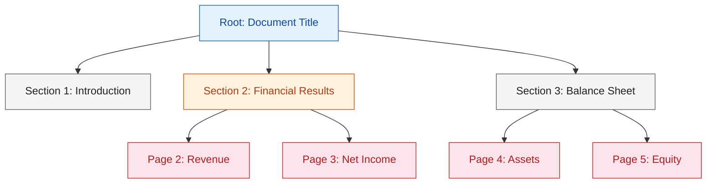
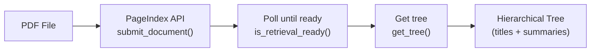
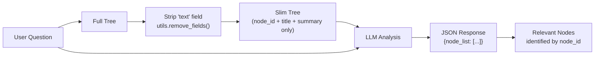

# 1. Lab Title

## Vectorless RAG: Reasoning-Based Retrieval without Embeddings

# What is Vectorless RAG?

**Vectorless RAG** replaces embeddings, vector stores, and text chunking with a single idea: let a Language Model (LLM) *reason over a document tree* and then *read the extracted text* from relevant pages.

Traditional RAG pipelines embed text chunks into a vector database and retrieve via cosine similarity. This works well for plain text, but can be overkill for structured documents like PDFs.

Vectorless RAG takes a different approach:
- **No embeddings** — the LLM reads titles and summaries to find relevant sections.
- **No vector store** — retrieval is done by reasoning, not similarity.
- **No text chunking** — the LLM reads extracted text from the original pages.

This is simpler, faster, and easier to understand.

# 2. Problem Statement / Use Case Overview

How do we query a PDF and get accurate answers without building a vector database?

The pipeline works in two stages:

1. **Tree-based retrieval** — An LLM reads a hierarchical tree of the document (titles + summaries only) and reasons about which sections are most relevant to the user's question.
2. **Text-based QA** — The LLM then reads the extracted text from those pages and generates an answer.

This is especially useful for:
- Policy documents and contracts
- Technical documentation
- Reports and manuals
- Any structured PDF where you want fast, accurate answers

# 3. Input Data

| Item | Detail |
|------|--------|
| User query | Natural-language question about a PDF document |
| PDF document | CCS Q1 2025 Earnings Release 8-K (`data/CCS 3.31.25 Earnings Release 8-K Exhibit 99.1.pdf`) |
| PageIndex API Key | Used to parse the PDF into a hierarchical tree |
| OpenRouter API Key | Used to call the Language Model (Llama 4 Scout) |

# 4. Processing

### Overall Workflow


### How PageIndex Builds the Tree

PageIndex parses the PDF into a hierarchical tree. The root represents the entire document, middle nodes represent sections/subsections, and leaf nodes represent individual pages.



1. The **PageIndex API** parses the PDF into a tree of sections and subsections, each annotated with a title and summary.
2. The **LLM** receives the tree (without full text) and the user's question. It reasons over titles and summaries to identify which nodes are most likely to contain the answer.
3. The text from matching PDF pages is **extracted** using PyMuPDF.
4. The **LLM** answers the question by reading the extracted text — providing accurate, grounded answers.

# 5. Output

A natural-language answer grounded in the extracted text, e.g.:

> _"The total revenues for Q1 2025 were $XXX million, as reported in the earnings release."_

# 6. Pre-requisites

- Basic familiarity with Python (functions, `import` statements).
- **PageIndex API Key** — sign up at [pageindex.ai](https://pageindex.ai).
- **OpenRouter API Key** — sign up at [openrouter.ai](https://openrouter.ai).
- High-level understanding of what an LLM is and what a "context window" means.
- (Optional) Awareness of traditional RAG pipelines (embeddings, vector stores).

# 7. Environment / Dependencies Setup

## Install Dependencies

The cell below installs all required Python packages:

| Package | Purpose |
|---------|---------|
| `pageindex` | Document tree generation and retrieval via PageIndex API |
| `openai` | LLM client (used with OpenRouter's OpenAI-compatible endpoint) |
| `python-dotenv` | Load API keys from `.env` file |
| `pymupdf` | Extract text from PDF pages |

Run this cell first — it only needs to be run once per session.

```python
!pip install -q pageindex openai python-dotenv pymupdf
```

## Import Libraries

Import the standard library and third-party modules used throughout the notebook. `os` and `json` handle file paths and caching. `re` parses JSON from LLM responses. `pymupdf` extracts text from PDFs. `OpenAI` is the LLM client. `load_dotenv` loads API keys from the `.env` file.

```python
import os       # for environment variables
import json     # for parsing LLM JSON responses
import pymupdf  # for extracting text from PDF files
from openai import OpenAI  # OpenAI-compatible client (works with OpenRouter)
from dotenv import load_dotenv  # loads API keys from .env file
```

## Load API Keys

Load API keys from the `.env` file in the project root (`../.env` relative to this notebook). The `.env` file should contain `PAGEINDEX_API_KEY` and `OPENROUTER_API_KEY`. If either key is missing, you'll be prompted to enter it manually.

```python
load_dotenv("../.env")

PAGEINDEX_API_KEY = os.getenv("PAGEINDEX_API_KEY")
OPENROUTER_API_KEY = os.getenv("OPENROUTER_API_KEY")

# If keys are missing, prompt the user to enter them
if not PAGEINDEX_API_KEY:
    PAGEINDEX_API_KEY = input("Enter your PageIndex API key (get one at https://pageindex.ai): ").strip()
if not OPENROUTER_API_KEY:
    OPENROUTER_API_KEY = input("Enter your OpenRouter API key (get one at https://openrouter.ai): ").strip()

print("Keys loaded.")
```

## Set Up the LLM

### `call_llm(prompt, model)`

Sends a prompt to the LLM via OpenRouter and returns the response text. Creates a fresh OpenAI client pointed at OpenRouter's API endpoint (`https://openrouter.ai/api/v1`). Uses `meta-llama/llama-4-scout-17b-16e-instruct` by default with `temperature=0` for deterministic output.

```python
# Calls an LLM via OpenRouter's OpenAI-compatible API
# - prompt: the text to send to the model
# - model: which model to use (default is free tier)
def call_llm(prompt, model="nvidia/nemotron-3-ultra-550b-a55b:free"):
    # Create OpenAI-compatible client pointed at OpenRouter
    client = OpenAI(base_url="https://openrouter.ai/api/v1", api_key=OPENROUTER_API_KEY)
    return client.chat.completions.create(
        model=model,
        messages=[{"role": "user", "content": prompt}],  # single user message
        temperature=0,   # deterministic output (no randomness)
        max_tokens=512  # cap response length
    ).choices[0].message.content.strip()
```

---

## Step 2 — Build Document Tree

The PageIndex API parses the PDF into a hierarchical tree of sections and subsections, each annotated with a title and summary.



### Build Document Tree

```python
# PageIndex SDK for document tree generation and utilities
from pageindex import PageIndexClient
from pageindex import utils
import time

# Submit PDF to PageIndex for tree generation
pi = PageIndexClient(api_key=PAGEINDEX_API_KEY)
result = pi.submit_document(PDF_PATH)
doc_id = result["doc_id"]
print(f"Submitted: {doc_id}")

# Poll until processing completes (max 5 min)
elapsed = 0
while elapsed < 300:
    if pi.is_retrieval_ready(doc_id):
        break
    time.sleep(5)
    elapsed += 5
    print(f"  {elapsed}s...")
else:
    raise TimeoutError("PageIndex timeout")

# Retrieve the hierarchical tree (titles + summaries, no full text)
tree = pi.get_tree(doc_id, node_summary=True)["result"]
utils.print_tree(tree, exclude_fields=["text"])
```

---

## Step 3 — Ask a Question

Define the question you want to ask about the document. The LLM will use the tree to find relevant sections, then read the extracted text from those pages to answer.

```python
QUERY = "What was the total revenue reported in the earnings release?"
```

---

## Step 4 — LLM Finds Relevant Sections

The LLM reads the tree (titles + summaries only — no full text) and picks which nodes likely contain the answer.



### Search the Tree

```python
# Strip full text from tree — LLM only needs titles + summaries to pick relevant nodes
tree_slim = utils.remove_fields(tree.copy(), fields=["text"])

# Ask the LLM which nodes are relevant to the question
# We use JSON format so we can reliably extract structured data
search_prompt = f"""
IMPORTANT: You MUST respond with valid JSON only. No other text.

You are given a question and a document tree.
Each node has: node_id, title, summary.
Find all nodes likely to contain the answer.

Question: {QUERY}

Document tree:
{json.dumps(tree_slim, indent=2)}

Respond with ONLY this JSON format:
{{
    "thinking": "<your reasoning>",
    "node_list": ["node_id_1", "node_id_2"]
}}
"""

# Try to parse JSON — handle cases where LLM adds extra text or returns invalid JSON
try:
    result = json.loads(call_llm(search_prompt))
except json.JSONDecodeError:
    # Fallback: try to extract JSON from the response using regex
    import re
    match = re.search(r'\{{.*\}}', call_llm(search_prompt), re.DOTALL)
    if match:
        result = json.loads(match.group())
    else:
        print("Could not parse LLM response. Using empty result.")
        result = {"thinking": "", "node_list": []}
```

### Map Nodes to Page Numbers

The LLM returns node IDs (e.g. `0000`, `0001`), but we need to know which **pages** those nodes correspond to. This step is required because the next cell extracts text from PDF pages — and it needs page numbers, not node IDs.

```python
# Map node IDs to their metadata (title, page range, etc.)
node_map = utils.create_node_mapping(tree, include_page_ranges=True, max_page=len(page_texts))

# Display the LLM's reasoning and which nodes it selected
print("\nReasoning:", result.get("thinking", ""), "\n")
print("Retrieved nodes:")
for nid in result.get("node_list", []):
    if nid in node_map:
        info = node_map[nid]
        # Show single page number or range (e.g. "3" or "3-5")
        pages = info['start_index'] if info['start_index'] == info['end_index'] else f"{info['start_index']}-{info['end_index']}"
        print(f"  {nid} | Pages {pages} | {info['node']['title']}")
    else:
        print(f"  {nid} | not found in tree")
```

---

## Step 5 — LLM Answers from Extracted Text

Map the retrieved node IDs to page numbers, extract text from those pages, and have the LLM read it to generate the final answer.


### Extract Text from PDF

Extract text from each page of the PDF using PyMuPDF.

```python
PDF_PATH = "data/CCS 3.31.25 Earnings Release 8-K Exhibit 99.1.pdf"

doc = pymupdf.open(PDF_PATH)
# len(doc) = total pages; i goes from 0 to len(doc)-1
# i+1 makes page numbers 1-based (page 1, 2, 3...)
# doc.load_page(i).get_text() extracts raw text from page i
page_texts = {i+1: doc.load_page(i).get_text() for i in range(len(doc))}
doc.close()
print(f"Extracted text from {len(page_texts)} pages.")
```

### Build Context

```python
# Collect text from pages covered by retrieved nodes (deduplicating pages)
texts, seen = [], set()
for nid in result.get("node_list", []):
    if nid not in node_map:
        continue
    info = node_map[nid]
    # Loop through each page in the node's range
    for p in range(info["start_index"], info["end_index"] + 1):
        # Only add if we haven't seen this page and it has text
        if p not in seen and p in page_texts:
            texts.append(f"--- Page {p} ---\n{page_texts[p]}")
            seen.add(p)
# Join all extracted text into one context string
context = "\n\n".join(texts)
print(f"Using {len(context.splitlines())} lines of text.")
```

### Generate Answer

Send the extracted text (context) along with the question to the LLM. The prompt instructs the LLM to answer only from the provided context and be concise.

```python
# Send the extracted text + question to the LLM for the final answer.
# The prompt tells the LLM to only use the provided context.
answer_prompt = f"""
Answer the question based on the provided text.

Context:
{context}

Question: {QUERY}

Rules:
- Answer only from the context
- If the answer isn't there, say so
- Be concise
"""

answer = call_llm(answer_prompt)
print(answer)
```

---

## Try It Yourself

Change `QUERY` above and re-run from **Step 4**.

| Question | What to look for |
|---|---|
| "What was the total revenue?" | Revenue section |
| "What is the net income?" | Income statement |
| "How did diluted EPS change year-over-year?" | EPS metrics |
| "What are the key financial highlights?" | Executive summary |
