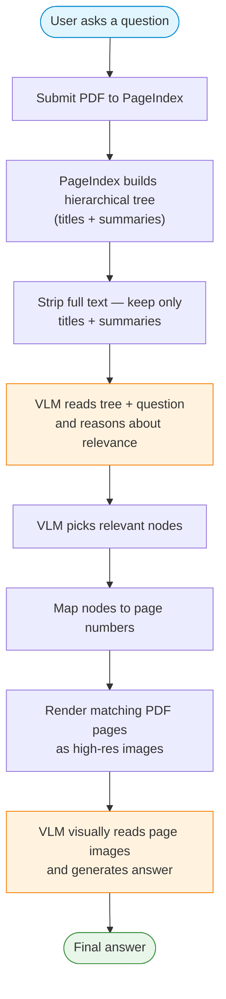
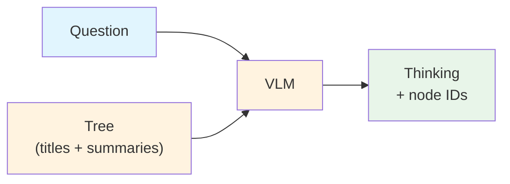
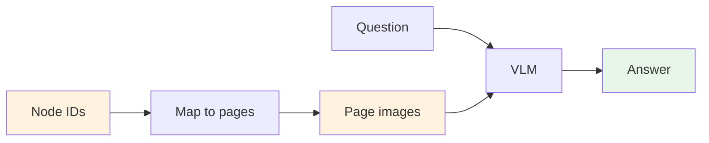

# 1. Lab Title

## Vectorless RAG: Reasoning-Based Retrieval with Vision-Language Models

# What is Vectorless RAG?

**Vectorless RAG** replaces embeddings, vector stores, and text chunking with a single idea: let a Vision-Language Model (VLM) *reason over a document tree* and then *visually read* the actual PDF pages.

Traditional RAG pipelines embed text chunks into a vector database and retrieve via cosine similarity. This works well for plain text, but **loses layout, figures, tables, and equations** — information that lives in the *visual structure* of a document.

Vectorless RAG takes a different approach:
- **No embeddings** — the VLM reads titles and summaries to find relevant sections.
- **No vector store** — retrieval is done by reasoning, not similarity.
- **No text chunking** — the VLM inspects rendered page images directly.

This preserves the full visual context of the original document.

# 2. Problem Statement / Use Case Overview

How do we query a PDF and get accurate answers that respect figures, tables, and document layout — without building a vector database?

The pipeline works in two stages:

1. **Tree-based retrieval** — A VLM reads a hierarchical tree of the document (titles + summaries only) and reasons about which sections are most relevant to the user's question.
2. **Visual QA** — The VLM then *visually reads* the actual PDF page images corresponding to those sections and generates an answer grounded in the original layout.

This is especially useful for:
- Academic papers with figures and equations
- Financial reports with charts and tables
- Technical documentation with diagrams
- Legal documents where formatting carries meaning

# 3. Input Data

| Item | Detail |
|------|--------|
| User query | Natural-language question about a PDF document |
| PDF document | Medicare Plus health insurance policy (`data/synthetic_medicare_plus_policy_detailed.pdf`) |
| PageIndex API Key | Used to parse the PDF into a hierarchical tree |
| OpenRouter API Key | Used to call the Vision-Language Model (Llama 4 Scout) |

# 4. Processing



1. The **PageIndex API** parses the PDF into a tree of sections and subsections, each annotated with a title and summary.
2. The **VLM** receives the tree (without full text) and the user's question. It reasons over titles and summaries to identify which nodes are most likely to contain the answer.
3. The matching PDF pages are **rendered as JPEG images** using PyMuPDF.
4. The **VLM** answers the question by visually inspecting those page images — preserving layout, figures, and tables.

# 5. Output

A natural-language answer grounded in the actual PDF page images, e.g.:

> _"The GST rate applied to the premium is 18%, as specified in Section 5.13 of the policy document."_

Additionally, a **Mermaid diagram** of the pipeline architecture is rendered inline in the notebook.

# 6. Tech Stack

| Layer | Technology |
|-------|------------|
| VLM | Llama 4 Scout via OpenRouter |
| Document Parsing | PageIndex API |
| PDF Rendering | PyMuPDF (`fitz`) |
| LLM Client | OpenAI SDK (compatible with OpenRouter) |
| Language | Python 3.12 |
| Runtime | Jupyter Notebook |

# 7. Underlying Concepts

- **Vectorless Retrieval** — Finding relevant document sections by reasoning over titles and summaries, not by cosine similarity over embeddings.
- **Hierarchical Document Tree** — A nested structure of sections and subsections produced by PageIndex, enabling targeted retrieval at the right granularity.
- **Visual Question Answering (VQA)** — The VLM reads rendered page images instead of extracted text, preserving layout, figures, tables, and equations.
- **Vision-Language Model (VLM)** — A model that can process both text and images, enabling it to visually inspect PDF pages.
- **Two-Stage Retrieval** — First, the VLM identifies relevant sections via the tree. Then, it reads the actual pages to generate the answer.

> Refer to the original implementation: [Clement-Okolo/Vectorless-Rag](https://github.com/Clement-Okolo/Vectorless-Rag)

# 8. Pre-requisites

- Basic familiarity with Python (functions, `import` statements).
- **PageIndex API Key** — sign up at [pageindex.ai](https://pageindex.ai).
- **OpenRouter API Key** — sign up at [openrouter.ai](https://openrouter.ai).
- High-level understanding of what an LLM is and what a "context window" means.
- (Optional) Awareness of traditional RAG pipelines (embeddings, vector stores).

# 9. Environment / Dependencies Setup

The cell below installs all required Python packages:

| Package | Purpose |
|---------|---------|
| `pageindex` | Document tree generation and retrieval via PageIndex API |
| `openai` | LLM client (used with OpenRouter's OpenAI-compatible endpoint) |
| `python-dotenv` | Load API keys from `.env` file |
| `pymupdf` | Render PDF pages as high-quality JPEG images |

Run this cell first — it only needs to be run once per session.

```python
!pip install -q pageindex openai python-dotenv pymupdf
```

### Load API Keys

Your API keys are stored in the `.env` file in the project root. The cell below loads them.

```python
import os
import json
import base64
import re
import fitz  # PyMuPDF
from openai import OpenAI
from dotenv import load_dotenv

load_dotenv("../.env")

PAGEINDEX_API_KEY = os.getenv("PAGEINDEX_API_KEY")
OPENROUTER_API_KEY = os.getenv("OPENROUTER_API_KEY")

print("Keys loaded.")
```

### Set up the VLM

This function sends prompts (and optionally images) to the VLM via OpenRouter.

```python
def call_vlm(prompt, image_paths=None, model="meta-llama/llama-4-scout-17b-16e-instruct"):
    """Call a vision model via OpenRouter."""
    client = OpenAI(
        base_url="https://openrouter.ai/api/v1",
        api_key=OPENROUTER_API_KEY,
    )
    if image_paths:
        content = [{"type": "text", "text": prompt}]
        for img in image_paths:
            if os.path.exists(img):
                with open(img, "rb") as f:
                    b64 = base64.b64encode(f.read()).decode()
                content.append({"type": "image_url", "image_url": {"url": f"data:image/jpeg;base64,{b64}"}})
        msgs = [{"role": "user", "content": content}]
    else:
        msgs = [{"role": "user", "content": prompt}]
    resp = client.chat.completions.create(model=model, messages=msgs, temperature=0, max_tokens=1024)
    return resp.choices[0].message.content.strip()
```

---

## Step 1 — Render PDF Pages

Convert each page of the PDF into a high-resolution JPEG image. These images will be used as visual context for the VLM later.

```python
PDF_PATH = "data/synthetic_medicare_plus_policy_detailed.pdf"

def extract_page_images(pdf_path, out="pdf_images"):
    os.makedirs(out, exist_ok=True)
    doc = fitz.open(pdf_path)
    imgs = {}
    for i in range(len(doc)):
        pix = doc.load_page(i).get_pixmap(matrix=fitz.Matrix(2.0, 2.0))
        path = os.path.join(out, f"page_{i+1}.jpg")
        open(path, "wb").write(pix.tobytes("jpeg"))
        imgs[i+1] = path
    doc.close()
    return imgs

page_images = extract_page_images(PDF_PATH)
print(f"Rendered {len(page_images)} pages.")
```

---

## Step 2 — Build Document Tree (with caching)

PageIndex parses the PDF into a hierarchical tree of sections and subsections, each with a title and summary.

The tree is saved to `cache/` as a JSON file keyed by the PDF filename. On repeat runs with the same PDF, the cached tree is loaded instantly — no need to re-process with PageIndex.

### Set up caching helpers

```python
from pageindex import PageIndexClient
from pageindex import utils
import hashlib

CACHE_DIR = "cache"
os.makedirs(CACHE_DIR, exist_ok=True)

def get_cache_path(pdf_path):
    """Generate a cache file path based on the PDF filename."""
    pdf_name = os.path.splitext(os.path.basename(pdf_path))[0]
    return os.path.join(CACHE_DIR, f"{pdf_name}_tree.json")

def load_cached_tree(pdf_path):
    """Load tree from cache if it exists."""
    cache_path = get_cache_path(pdf_path)
    if os.path.exists(cache_path):
        with open(cache_path, "r") as f:
            tree = json.load(f)
        print(f"Loaded tree from cache: {cache_path}")
        return tree
    return None

def save_tree_to_cache(pdf_path, tree):
    """Save tree to cache."""
    cache_path = get_cache_path(pdf_path)
    with open(cache_path, "w") as f:
        json.dump(tree, f, indent=2)
    print(f"Tree saved to cache: {cache_path}")
```

### Load or build the tree

```python
pi = PageIndexClient(api_key=PAGEINDEX_API_KEY)

# Try loading from cache first
tree = load_cached_tree(PDF_PATH)

if tree is None:
    # Cache miss — submit to PageIndex and wait
    print("Cache miss — submitting to PageIndex...")
    result = pi.submit_document(PDF_PATH)
    doc_id = result["doc_id"]
    print(f"Submitted: {doc_id}")

    if pi.is_retrieval_ready(doc_id):
        tree = pi.get_tree(doc_id, node_summary=True)["result"]
        save_tree_to_cache(PDF_PATH, tree)
    else:
        print("Still processing — try again shortly.")

utils.print_tree(tree, exclude_fields=["text"])
```

---

## Step 3 — Ask a Question

Define the question you want to ask about the document.

```python
QUERY = "What is the GST rate applied to the premium?"
```

---

## Step 4 — VLM Finds Relevant Sections

The VLM reads the tree (titles + summaries only — no full text) and picks which nodes likely contain the answer.



```python
tree_slim = utils.remove_fields(tree.copy(), fields=["text"])

search_prompt = f"""
You are given a question and a document tree.
Each node has: node_id, title, summary.
Find all nodes likely to contain the answer.

Question: {QUERY}

Document tree:
{json.dumps(tree_slim, indent=2)}

Reply in this JSON format ONLY:
{{
    "thinking": "<your reasoning>",
    "node_list": ["node_id_1", "node_id_2"]
}}
"""

raw_result = call_vlm(search_prompt)
print(raw_result)
```

Parse the VLM's response and display the retrieved nodes.

```python
def parse_json(text):
    text = re.sub(r"```json\s*|\s*```", "", text.strip())
    s, e = text.find("{"), text.rfind("}")
    if s != -1 and e != -1:
        text = text[s:e+1]
    return json.loads(text)

result = parse_json(raw_result)
node_map = utils.create_node_mapping(tree, include_page_ranges=True, max_page=len(page_images))

print("Reasoning:", result["thinking"], "\n")
print("Retrieved nodes:")
for nid in result["node_list"]:
    info = node_map[nid]
    pages = info['start_index'] if info['start_index'] == info['end_index'] else f"{info['start_index']}-{info['end_index']}"
    print(f"  {nid} | Pages {pages} | {info['node']['title']}")
```

---

## Step 5 — VLM Answers from Page Images

Map the retrieved node IDs to page numbers, render those pages as images, and have the VLM visually read them to generate the answer.



```python
def images_for_nodes(nodes, node_map, page_images):
    paths, seen = [], set()
    for nid in nodes:
        info = node_map[nid]
        for p in range(info["start_index"], info["end_index"] + 1):
            if p not in seen and p in page_images:
                paths.append(page_images[p])
                seen.add(p)
    return paths

images = images_for_nodes(result["node_list"], node_map, page_images)
print(f"Using {len(images)} page image(s).")
```

```python
answer_prompt = f"""
Answer the question based on the provided page images.

Question: {QUERY}

Rules:
- Answer only from the images
- If the answer isn't there, say so
- Be concise
"""

answer = call_vlm(answer_prompt, image_paths=images)
print(answer)
```

---

## Try It Yourself

Change `QUERY` above and re-run from **Step 4**.

| Question | What to look for |
|---|---|
| "What is the GST rate?" | GST section |
| "What is the Free-Look Period?" | Policy terms |
| "How many Day Care Procedures are covered?" | Benefits section |
| "What is the PED Waiting Period?" | Waiting periods |
