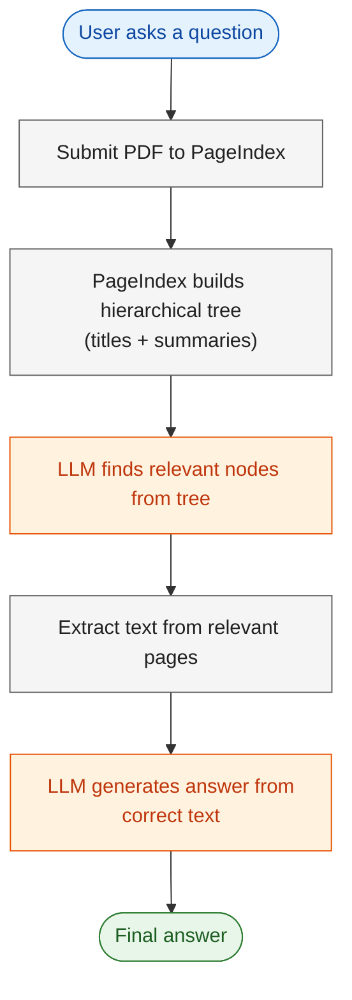
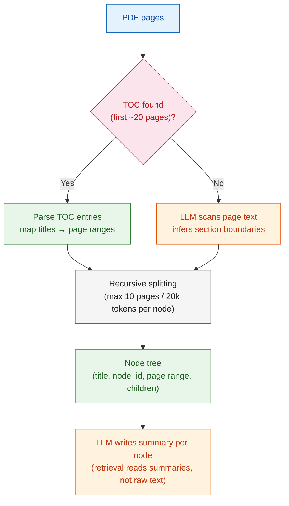
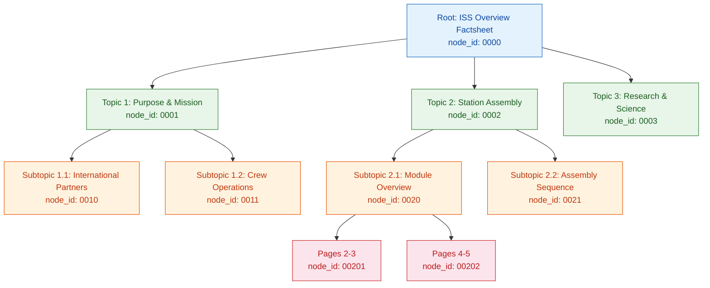
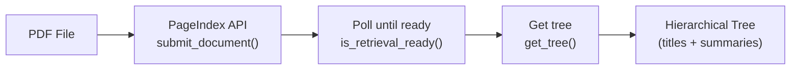
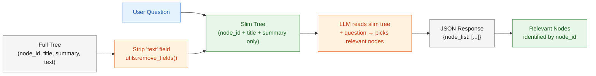
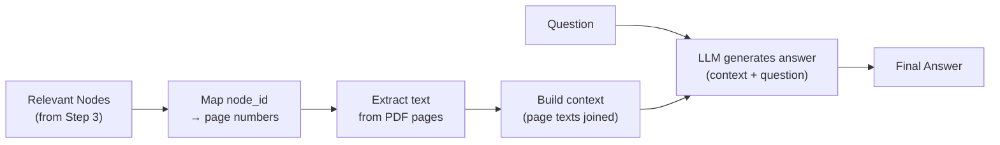

# Vectorless RAG: Reasoning-Based Retrieval without Embeddings

---

# Problem Statement / Use Case Overview

How do we query a PDF and get accurate answers without building a vector database?

**The pipeline works in two stages:**

1. **Tree-based retrieval** — An LLM reads a **hierarchical tree** of the document (titles + summaries only) and **reasons** about which sections are most relevant to the user's question.
2. **Text-based QA** — The LLM then reads the **extracted text** from those pages and generates an answer.

This is especially useful for:
- **Policy documents and contracts**
- **Technical documentation**
- **Reports and manuals**
- **Any structured PDF** where you want fast, accurate answers

---

# Input Data

| Item | Detail |
|------|--------|
| **User query** | Natural-language question about a document |
| **PDF document** | NASA ISS Overview Factsheet (`https://www.nasa.gov/pdf/65431main_ffs_factsheets_issoverview.pdf`) — downloaded and used for tree generation and text extraction |
| **PageIndex API Key** | Used to parse the PDF into a hierarchical tree |
| **AWS Bedrock Credentials** | Access Key ID, Secret Access Key, Endpoint URL, Region — used to call the LLM |

---

# Processing

### Overall Workflow



### How PageIndex Builds the Tree



1. **PDF pages** — text is pulled out page by page (the open-source version uses standard PDF parsing; PageIndex's hosted API swaps this for enhanced OCR (Optical Character Recognition) on messier PDFs).
2. **TOC check** — it scans roughly the **first 20 pages** looking for a real table of contents. Insurance policy docs and financial reports often have one; if found, PageIndex parses those entries and maps each title to its actual start/end page in the body.
3. **Heading detection** — if no TOC exists, an LLM reads through the page text directly and **infers section boundaries** itself (font-size/indent cues aren't used — it's reasoning over text, similar to how a person skims for headings).
4. **Recursive splitting** — whichever path found the boundaries, each section then gets recursively broken into child nodes if it's too big, bounded by two caps: **max pages per node** (default 10) and **max tokens per node** (default 20,000). This is what keeps a single node from becoming a 40-page dump.
5. **Node tree** — the output is a JSON tree where every node carries a **title**, **node_id**, **start_index/end_index** (page range), and nested nodes for children. If summaries are enabled (default on), a final pass has the LLM write a **short summary per node** — that summary is what the retrieval-time LLM actually reads to decide which branch to follow, not the raw text.

The resulting tree structure looks like this:



---

# Output

A natural-language answer grounded in the extracted text, e.g.:

> _"The International Space Station serves as a microgravity and space environment research laboratory where scientific research is conducted in astrobiology, astronomy, physical science, and Earth science."_

---

# Tech Stack

| Component | Tool |
|---|---|
| **Document Parsing** | PageIndex API — builds hierarchical tree from PDF |
| **Text Extraction** | PyMuPDF — extracts raw text from PDF pages |
| **LLM** | Amazon Nova Lite v1 (via AWS Bedrock + LangChain) — finds relevant sections and generates answers |
| **LLM Framework** | LangChain (`langchain-aws`, `langchain-core`) — typed messages and Bedrock integration |
| **Environment** | Environment variables — AWS credentials set via `os.environ` |

---

# Underlying Concepts (Summarized)

**Vectorless RAG** replaces embeddings, vector stores, and text chunking with a single idea: let a Language Model (LLM) **reason over a document tree** and then **read the extracted text** from relevant pages.

Traditional RAG pipelines embed text chunks into a vector database and retrieve via cosine similarity. This works well for plain text, but can be overkill for structured documents like PDFs.

**Vectorless RAG** takes a different approach:
- **No embeddings** — the LLM reads **titles and summaries** to find relevant sections.
- **No vector store** — retrieval is done by **reasoning**, not similarity.
- **No text chunking** — the LLM reads **extracted text** from the original pages.

> **Key Insight:** This is simpler, faster, and easier to understand — no vector database setup, no embedding model, no chunking strategy.

---

# Pre-requisites

- **Basic familiarity** with Python (functions, `import` statements).
- **PageIndex API Key** — sign up at [pageindex.ai](https://pageindex.ai).
- **AWS Bedrock Credentials** — Access Key ID, Secret Access Key, Endpoint URL, and Region (from the lab platform key icon).
- **High-level understanding** of what an LLM is and what a "context window" means.
- (Optional) Awareness of traditional RAG pipelines (embeddings, vector stores).

---

# Environment / Dependencies Setup

The cell below installs all required Python packages:

| Package | Purpose |
|---------|---------|
| `pageindex` | **Document tree generation** and retrieval via PageIndex API |
| `pymupdf` | **Text extraction** — extracts raw text from PDF pages |
| `langchain-aws` | **Bedrock integration** — `ChatBedrockConverse` wraps the Bedrock Converse API |
| `langchain-core` | **LangChain primitives** — `HumanMessage`, `AIMessage`, `SystemMessage` |
| `boto3` | **AWS SDK** — used internally by `langchain-aws` for authentication |

> **Note:** Run this cell first — it only needs to be run once per session.

```python
!pip install -q pageindex pymupdf langchain-aws langchain-core boto3
```

## Import Libraries

Import the standard library and third-party modules used throughout the notebook. **`os`** and **`json`** handle file paths and caching. **`time`** and **`requests`** handle polling and downloading. **`pymupdf`** extracts text from PDFs. **`PageIndexClient`** and **`utils`** are the PageIndex SDK for document tree generation. **`ChatBedrockConverse`** is the LangChain LLM client for AWS Bedrock. **`HumanMessage`** is a LangChain typed message object.

```python
import os       # for environment variables
import json     # for parsing LLM JSON responses
import time     # for polling
import requests # for downloading PDF
import pymupdf  # for PDF text extraction
from pageindex import PageIndexClient  # PageIndex API client
from pageindex import utils            # PageIndex utilities
from langchain_aws import ChatBedrockConverse  # LangChain AWS Bedrock client
from langchain_core.messages import HumanMessage  # typed message objects
```

## Configure AWS Bedrock Credentials

Set the four AWS Bedrock credentials as environment variables. These give you access to the Bedrock Converse API via the lab proxy. Copy all four values from the key icon on your lab platform.

```python
os.environ["AWS_ACCESS_KEY_ID"]     = "YOUR_ACCESS_KEY_ID"
os.environ["AWS_SECRET_ACCESS_KEY"] = "YOUR_SECRET_ACCESS_KEY"
os.environ["AWS_ENDPOINT_URL"]      = "https://api.enterprisesi.co/api/v1/aws-genai/bedrock-runtime"
os.environ["AWS_REGION"]            = "ap-south-1"

print("Credentials configured.")
```

## Load PageIndex API Key

PageIndex is the document parsing service that builds the hierarchical tree from your PDF. You need a free API key to use it. Sign up at [pageindex.ai](https://pageindex.ai) to get your key, then paste it when prompted by the cell below. The key is stored as an environment variable so the PageIndex client can authenticate.

```python
PAGEINDEX_API_KEY = input("Enter your PageIndex API key (get one at https://pageindex.ai): ").strip()
os.environ["PAGEINDEX_API_KEY"] = PAGEINDEX_API_KEY

print("PageIndex key loaded.")
```

## Set Up the LLM

### `call_llm(prompt, model)`

Sends a prompt to the LLM via AWS Bedrock and returns the response text. Uses LangChain's **`ChatBedrockConverse`** which wraps the Bedrock Converse API and handles authentication via the environment variables set above. Uses **Amazon Nova Lite v1** (`global.amazon.nova-2-lite-v1:0`) by default with **`temperature=0`** for deterministic output.

```python
def call_llm(prompt, model="global.amazon.nova-2-lite-v1:0"):
    llm = ChatBedrockConverse(
        model=model,
        temperature=0,
        max_tokens=512,
    )
    response = llm.invoke([HumanMessage(content=prompt)])
    return response.content.strip()
```

> 📝 **Note on Credentials:** To use the credentials, click the key icon on the top right corner of the platform. Copy the API Key and Endpoint URL (also copy the Secret Key if using the Claude model).

---

# Step-wise Instructions — Development

---

### Step 1 — Build Document Tree

This is the foundation of the entire Vectorless RAG pipeline. Before we can retrieve anything, we need to understand the structure of the document — and that is exactly what PageIndex does.

#### Download PDF

First, we download the PDF document from a URL and save it locally. This cell fetches the NASA ISS Overview Factsheet, creates a `data/` directory if needed, and writes the file to disk. The extracted path (`PDF_PATH`) will be used by PageIndex in the next cell.

```python
# Download the PDF from URL
PDF_URL = "https://www.nasa.gov/pdf/65431main_ffs_factsheets_issoverview.pdf"
PDF_DIR = "data"
PDF_PATH = os.path.join(PDF_DIR, "iss_overview.pdf")

# Create data directory if it doesn't exist
os.makedirs(PDF_DIR, exist_ok=True)

# Download the PDF
response = requests.get(PDF_URL)
response.raise_for_status()
with open(PDF_PATH, "wb") as f:
    f.write(response.content)
print(f"Downloaded PDF ({len(response.content)} bytes) to {PDF_PATH}")
```

#### Build Document Tree

The **PageIndex API** takes a PDF file and builds a **hierarchical tree** of sections and subsections. Each node in the tree carries a **title**, a **node_id**, a **page range**, and — crucially — a **summary** written by an LLM. These summaries are what make "vectorless" retrieval possible: instead of embedding text chunks into a vector database, the LLM at query time reads these summaries and **reasons** about which sections are relevant.

Here is what happens under the hood:

1. **`submit_document(PDF_PATH)`** — uploads the PDF to PageIndex and returns a `doc_id`. PageIndex begins parsing the document in the background.
2. **`is_retrieval_ready(doc_id)`** — we poll this until the tree is built. For a document like our ISS factsheet (2 pages), this typically takes 5–15 seconds. For larger documents (100+ pages), it can take a few minutes.
3. **`get_tree(doc_id, node_summary=True)`** — retrieves the fully built tree. The `node_summary=True` flag tells PageIndex to generate an LLM-written summary for each node. These summaries are what the retrieval-time LLM reads — not the raw text.

The resulting tree is a nested JSON structure. The **root node** represents the entire document. **Child nodes** represent sections and subsections, each with its own page range and summary. This hierarchical structure lets the LLM narrow down from broad sections to specific pages — without ever embedding a single vector.



```python
# Submit PDF to PageIndex for tree generation
pi = PageIndexClient(api_key=PAGEINDEX_API_KEY)
result = pi.submit_document(PDF_PATH)
doc_id = result["doc_id"]
print(f"Submitted: {doc_id}")

# Poll until processing completes (max 5 min)
elapsed = 0
while elapsed < 300:
    if pi.is_retrieval_ready(doc_id):
        break
    time.sleep(5)
    elapsed += 5
    print(f"  {elapsed}s...")
else:
    raise TimeoutError("PageIndex timeout")

# Retrieve the hierarchical tree (titles + summaries, no full text)
tree = pi.get_tree(doc_id, node_summary=True)["result"]
utils.print_tree(tree, exclude_fields=["text"])
```

---

### Step 2 — Ask a Question

Define the question you want to ask about the document. The LLM will use the **tree** to find relevant sections, then read the **extracted text** from those pages to answer.

This is a simple but critical step. The `QUERY` variable holds the natural-language question that drives the entire retrieval pipeline. In a production system, this would come from a user interface or an API call. Here, we hardcode it for simplicity — but the pipeline works the same way regardless of how the question is provided.

The question you ask determines which nodes the LLM will select from the tree. For example, asking about "purpose of the ISS" will cause the LLM to look for nodes whose summaries mention the station's mission, objectives, or research goals. Asking about "station modules" would steer it toward a completely different branch of the tree. This is the power of **reasoning-based retrieval** — the LLM understands the semantics of your question and matches it against the summaries, not against keyword overlaps or vector similarities.

```python
QUERY = "What is the purpose of the International Space Station?"
```

---

### Step 3 — LLM Finds Relevant Sections

This is the most intellectually interesting step in the pipeline — and the one that makes Vectorless RAG fundamentally different from traditional RAG.

The LLM reads the **tree** (titles + summaries only — no full text) and picks which nodes likely contain the answer. This is **reasoning-based retrieval**: instead of computing cosine similarity between an embedded query and embedded text chunks, we simply ask the LLM to read the tree structure and decide which sections are relevant.

Here is exactly what happens:

1. **Strip the tree** — We call `utils.remove_fields(tree.copy(), fields=["text"])` to remove the full text from each node. The LLM only needs **titles and summaries** to make its decision. This keeps the prompt short and focused — we are not wasting tokens on raw page text at this stage.
2. **Send to LLM** — We construct a prompt that includes the slim tree (as JSON) and the user's question. The prompt asks the LLM to respond with a JSON object containing a `thinking` field (its reasoning) and a `node_list` (the node IDs it thinks are relevant).
3. **Parse the response** — The LLM returns a JSON string. We parse it with `json.loads()`, with a regex fallback in case the LLM wraps the JSON in extra text.

The beauty of this approach is its transparency. The `thinking` field lets you see exactly **why** the LLM selected certain nodes — something that is opaque in vector-based retrieval where similarity scores are just numbers. Here, you can read the LLM's reasoning and verify that it makes sense.

Pay close attention to the node IDs the LLM returns (e.g., `0000`, `0001`). These are the identifiers we will use in the next step to extract the actual page text. The LLM is essentially saying: "Based on the summaries I read, these are the sections most likely to contain the answer to your question."



#### Search the Tree

This cell sends the slim tree (titles + summaries only) to the LLM along with your question. The LLM returns a JSON with its reasoning (`thinking`) and the relevant node IDs (`node_list`). A regex fallback handles cases where the LLM wraps JSON in extra text.

```python
# Strip full text from tree — LLM only needs titles + summaries to pick relevant nodes
tree_slim = utils.remove_fields(tree.copy(), fields=["text"])

# Ask the LLM which nodes are relevant to the question
# We use JSON format so we can reliably extract structured data
search_prompt = f"""
IMPORTANT: You MUST respond with valid JSON only. No other text.

You are given a question and a document tree.
Each node has: node_id, title, summary.
Find all nodes likely to contain the answer.

Question: {QUERY}

Document tree:
{json.dumps(tree_slim, indent=2)}

Respond with ONLY this JSON format:
{{
    "thinking": "<your reasoning>",
    "node_list": ["node_id_1", "node_id_2"]
}}
"""

# Try to parse JSON — handle cases where LLM adds extra text or returns invalid JSON
import re
response = call_llm(search_prompt)
try:
    result = json.loads(response)
except json.JSONDecodeError:
    # Fallback: try to extract JSON from the response using regex
    match = re.search(r'\{.*\}', response, re.DOTALL)
    if match:
        result = json.loads(match.group())
    else:
        print("Could not parse LLM response. Using empty result.")
        result = {"thinking": "", "node_list": []}
```

#### Map Nodes to Page Numbers

This cell maps the LLM's selected node IDs to their page numbers using `create_node_mapping()`. It displays the LLM's reasoning and which nodes it selected along with their page ranges.

```python
# Map node IDs to their metadata (title, page range, etc.)
node_map = utils.create_node_mapping(tree, include_page_ranges=True)

# Display the LLM's reasoning and which nodes it selected
print("\nReasoning:", result.get("thinking", ""), "\n")
print("Retrieved nodes:")
for nid in result.get("node_list", []):
    if nid in node_map:
        info = node_map[nid]
        # Show single page number or range (e.g. "3" or "3-5")
        pages = info['start_index'] if info['start_index'] == info['end_index'] else f"{info['start_index']}-{info['end_index']}"
        print(f"  {nid} | Pages {pages} | {info['node']['title']}")
    else:
        print(f"  {nid} | not found in tree")
```

---

### Step 4 — LLM Answers from Extracted Text

This is where everything comes together. We take the **node IDs** the LLM selected in Step 3, map them to page numbers, extract the raw text from those pages, and send it all to the LLM for the final answer.

Here is exactly what happens:

1. **Map node IDs to pages** — Each node in the tree has a `start_index` and `end_index` representing its page range. We use `utils.create_node_mapping()` to build a lookup table that maps node IDs to their page ranges. This is the bridge between the tree structure and the actual PDF pages.
2. **Extract text from pages** — We use **PyMuPDF** to extract raw text from each page of the PDF. We package it into a `page_texts` dictionary so the context-building code can reference it by page number.
3. **Build context** — We loop through the selected node IDs, look up their page ranges, and collect the text from each page. We deduplicate pages (in case multiple nodes overlap) and join everything into a single `context` string. This context contains only the relevant text — not the entire document.
4. **Generate the answer** — We send the context and the original question to the LLM. The prompt explicitly tells the LLM to answer only from the provided context and to say "I don't know" if the answer is not there. This prevents hallucination and keeps the answer grounded in the actual document content.

The key insight is that the LLM never sees the full document at query time. It only sees the **relevant pages** identified by the tree retrieval step. This is what makes Vectorless RAG efficient — you are not stuffing an entire 50-page document into the context window. You are surgically extracting the 2-3 pages that matter and letting the LLM focus its attention there.



#### Extract Text from PDF

This cell uses PyMuPDF to extract raw text from each page of the PDF. It returns a dictionary mapping page numbers (1-based) to their text content.

```python
# Open the PDF and extract text from each page using PyMuPDF
doc = pymupdf.open(PDF_PATH)
page_texts = {i+1: doc.load_page(i).get_text() for i in range(len(doc))}
doc.close()
print(f"Extracted text from {len(page_texts)} pages.")
```

#### Build Context

This cell collects text from pages covered by the LLM's selected nodes, deduplicates pages, and joins them into a single context string for the final answer.

```python
# Collect text from pages covered by retrieved nodes (deduplicating pages)
texts, seen = [], set()
for nid in result.get("node_list", []):
    if nid not in node_map:
        continue
    info = node_map[nid]
    page = info["node"].get("page_index")
    if page is None or page not in page_texts:
        continue
    if page not in seen:
        texts.append(f"--- Page {page} ---\n{page_texts[page]}")
        seen.add(page)
# Join all extracted text into one context string
context = "\n\n".join(texts)
print(f"Using {len(context.splitlines())} lines of text.")
```

#### Generate Answer

This cell sends the extracted text (context) along with the question to the LLM. The prompt instructs the LLM to answer only from the provided context and be concise.

```python
# Send the extracted text + question to the LLM for the final answer.
# The prompt tells the LLM to only use the provided context.
system_prompt = f"""
Answer the question based on the provided text.

Context:
{context}

Question: {QUERY}

Rules:
- Answer only from the context
- If the answer isn't there, say so
- Be concise
"""

answer = call_llm(system_prompt)
print(answer)
```

---

# Optional Exercise

Challenge yourself to extend or modify this lab:

- Change the LLM from **Amazon Nova Lite** to a different Bedrock model (e.g., `global.anthropic.claude-haiku-4-5-20251001-v1:0` or `global.anthropic.claude-sonnet-4-5-20250929-v1:0`) and compare answer quality.
- Swap **PageIndex** for a different document parsing approach and observe how the retrieval quality changes.
- Try modifying the `QUERY` variable with different questions about the ISS (e.g., "What are the main modules?", "How is the station powered?", "Who manages the ISS?") and verify the answers.

---

# What We Learnt

You built a **Vectorless RAG** pipeline that retrieves and answers questions from a PDF without using embeddings, vector stores, or text chunking.

**Key takeaways:**
- **Tree-based retrieval** replaces vector similarity search — an LLM reads a hierarchical tree of titles and summaries to find relevant sections.
- **PageIndex** automates document parsing — it builds the tree from a PDF using TOC detection, heading inference, and recursive splitting.
- **Two-stage pipeline** — first the LLM identifies relevant nodes from the tree, then it reads extracted text from those pages to generate an answer.
- **No embedding model needed** — the LLM's own reasoning replaces cosine similarity for retrieval.
- **Simpler and faster** — fewer dependencies, less setup, and easier to debug than traditional RAG pipelines.
