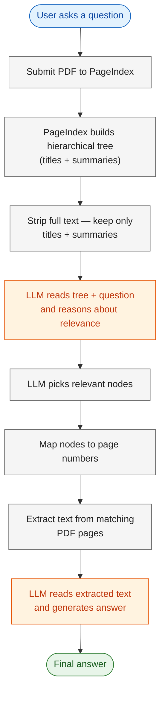

# 1. Lab Title

## Vectorless RAG: Reasoning-Based Retrieval without Embeddings

# What is Vectorless RAG?

**Vectorless RAG** replaces embeddings, vector stores, and text chunking with a single idea: let a Language Model (LLM) *reason over a document tree* and then *read the extracted text* from relevant pages.

Traditional RAG pipelines embed text chunks into a vector database and retrieve via cosine similarity. This works well for plain text, but can be overkill for structured documents like PDFs.

Vectorless RAG takes a different approach:
- **No embeddings** — the LLM reads titles and summaries to find relevant sections.
- **No vector store** — retrieval is done by reasoning, not similarity.
- **No text chunking** — the LLM reads extracted text from the original pages.

This is simpler, faster, and easier to understand.

# 2. Problem Statement / Use Case Overview

How do we query a PDF and get accurate answers without building a vector database?

The pipeline works in two stages:

1. **Tree-based retrieval** — An LLM reads a hierarchical tree of the document (titles + summaries only) and reasons about which sections are most relevant to the user's question.
2. **Text-based QA** — The LLM then reads the extracted text from those pages and generates an answer.

This is especially useful for:
- Policy documents and contracts
- Technical documentation
- Reports and manuals
- Any structured PDF where you want fast, accurate answers

# 3. Input Data

| Item | Detail |
|------|--------|
| User query | Natural-language question about a PDF document |
| PDF document | CCS Q1 2025 Earnings Release 8-K (`data/CCS 3.31.25 Earnings Release 8-K Exhibit 99.1.pdf`) |
| PageIndex API Key | Used to parse the PDF into a hierarchical tree |
| OpenRouter API Key | Used to call the Language Model (Llama 4 Scout) |

# 4. Processing



1. The **PageIndex API** parses the PDF into a tree of sections and subsections, each annotated with a title and summary.
2. The **LLM** receives the tree (without full text) and the user's question. It reasons over titles and summaries to identify which nodes are most likely to contain the answer.
3. The text from matching PDF pages is **extracted** using PyMuPDF.
4. The **LLM** answers the question by reading the extracted text — providing accurate, grounded answers.

# 5. Output

A natural-language answer grounded in the extracted text, e.g.:

> _"The total revenues for Q1 2025 were $XXX million, as reported in the earnings release."_

# 6. Tech Stack

| Layer | Technology |
|-------|------------|
| LLM | Llama 4 Scout via OpenRouter |
| Document Parsing | PageIndex API |
| PDF Text Extraction | PyMuPDF (`fitz`) |
| LLM Client | OpenAI SDK (compatible with OpenRouter) |
| Language | Python 3.12 |
| Runtime | Jupyter Notebook |

# 7. Underlying Concepts

- **Vectorless Retrieval** — Finding relevant document sections by reasoning over titles and summaries, not by cosine similarity over embeddings.
- **Hierarchical Document Tree** — A nested structure of sections and subsections produced by PageIndex, enabling targeted retrieval at the right granularity.
- **Text-Based QA** — The LLM reads extracted text from the original pages, preserving content without the overhead of image processing.
- **Two-Stage Retrieval** — First, the LLM identifies relevant sections via the tree. Then, it reads the actual page text to generate the answer.

> Refer to the original implementation: [Clement-Okolo/Vectorless-Rag](https://github.com/Clement-Okolo/Vectorless-Rag)

# 8. Pre-requisites

- Basic familiarity with Python (functions, `import` statements).
- **PageIndex API Key** — sign up at [pageindex.ai](https://pageindex.ai).
- **OpenRouter API Key** — sign up at [openrouter.ai](https://openrouter.ai).
- High-level understanding of what an LLM is and what a "context window" means.
- (Optional) Awareness of traditional RAG pipelines (embeddings, vector stores).

# 9. Environment / Dependencies Setup

## Install Dependencies

The cell below installs all required Python packages:

| Package | Purpose |
|---------|---------|
| `pageindex` | Document tree generation and retrieval via PageIndex API |
| `openai` | LLM client (used with OpenRouter's OpenAI-compatible endpoint) |
| `python-dotenv` | Load API keys from `.env` file |
| `pymupdf` | Extract text from PDF pages |

Run this cell first — it only needs to be run once per session.

```python
!pip install -q pageindex openai python-dotenv pymupdf
```

## Import Libraries

Import the standard library and third-party modules used throughout the notebook. `os` and `json` handle file paths and caching. `re` parses JSON from LLM responses. `fitz` (PyMuPDF) extracts text from PDFs. `OpenAI` is the LLM client. `load_dotenv` loads API keys from the `.env` file.

```python
import os
import json
import re
import fitz  # PyMuPDF — extracts text from PDF
from openai import OpenAI
from dotenv import load_dotenv
```

## Load API Keys

Load API keys from the `.env` file in the project root (`../.env` relative to this notebook). The `.env` file should contain `PAGEINDEX_API_KEY` and `OPENROUTER_API_KEY`. If either key is missing, you'll be prompted to enter it manually.

```python
load_dotenv("../.env")

PAGEINDEX_API_KEY = os.getenv("PAGEINDEX_API_KEY")
OPENROUTER_API_KEY = os.getenv("OPENROUTER_API_KEY")

# If keys are missing, prompt the user to enter them
if not PAGEINDEX_API_KEY:
    PAGEINDEX_API_KEY = input("Enter your PageIndex API key (get one at https://pageindex.ai): ").strip()
if not OPENROUTER_API_KEY:
    OPENROUTER_API_KEY = input("Enter your OpenRouter API key (get one at https://openrouter.ai): ").strip()

print("Keys loaded.")
```

## Set Up the LLM

### `call_llm(prompt, model)`

Sends a prompt to the LLM via OpenRouter and returns the response text. Creates a fresh OpenAI client pointed at OpenRouter's API endpoint (`https://openrouter.ai/api/v1`). Uses `meta-llama/llama-4-scout-17b-16e-instruct` by default with `temperature=0` for deterministic output.

```python
def call_llm(prompt, model="meta-llama/llama-4-scout-17b-16e-instruct"):
    """Call a language model via OpenRouter.

    Args:
        prompt: The text prompt to send to the model.
        model: The model identifier on OpenRouter.

    Returns:
        The model's text response.
    """
    client = OpenAI(
        base_url="https://openrouter.ai/api/v1",
        api_key=OPENROUTER_API_KEY,
    )
    msgs = [{"role": "user", "content": prompt}]
    resp = client.chat.completions.create(model=model, messages=msgs, temperature=0, max_tokens=1024)
    return resp.choices[0].message.content.strip()
```

---

## Step 1 — Extract Text from PDF

Extract text from each page of the PDF using PyMuPDF. This text will be used as context for the LLM in the final answer step.

### Define PDF Path

Set the path to the PDF document you want to query.

```python
PDF_PATH = "data/CCS 3.31.25 Earnings Release 8-K Exhibit 99.1.pdf"
```

### `extract_page_text(pdf_path)`

Opens a PDF with PyMuPDF (`fitz`) and extracts the text from each page. Returns a dictionary mapping 1-based page numbers to their extracted text strings. This preserves the original text flow, which is important for maintaining table structure and formatting.

```python
def extract_page_text(pdf_path):
    """Extract text from each PDF page.

    Returns:
        dict mapping 1-based page number to extracted text
    """
    doc = fitz.open(pdf_path)
    texts = {}
    for i in range(len(doc)):
        texts[i+1] = doc.load_page(i).get_text()
    doc.close()
    return texts
```

### Run Extraction

Call the extraction function on the PDF and print how many pages were processed.

```python
page_texts = extract_page_text(PDF_PATH)
print(f"Extracted text from {len(page_texts)} pages.")
```

---

## Step 2 — Build Document Tree (with caching)

The PageIndex API parses the PDF into a hierarchical tree of sections and subsections, each annotated with a title and summary. The tree is saved to `cache/` as a JSON file keyed by the PDF filename. On repeat runs with the same PDF, the cached tree is loaded instantly — no need to re-process with PageIndex.

### Set Up Caching

Import the PageIndex client and utility functions, and define the cache directory. The cache stores the document tree as JSON so we don't have to re-call the PageIndex API for the same PDF.

```python
from pageindex import PageIndexClient
from pageindex import utils
import time

CACHE_DIR = "cache"
os.makedirs(CACHE_DIR, exist_ok=True)
```

### `get_cache_path(pdf_path)`

Generates the cache file path based on the PDF filename. For example, `data/my_doc.pdf` becomes `cache/my_doc_tree.json`.

```python
def get_cache_path(pdf_path):
    """Generate a cache file path based on the PDF filename."""
    pdf_name = os.path.splitext(os.path.basename(pdf_path))[0]
    return os.path.join(CACHE_DIR, f"{pdf_name}_tree.json")
```

### `load_cached_tree(pdf_path)`

Attempts to load a previously saved tree from the cache. Returns the tree dict if found, or `None` if no cache exists (cache miss). This avoids redundant API calls when running the notebook multiple times with the same PDF.

```python
def load_cached_tree(pdf_path):
    """Load tree from cache if it exists, otherwise return None."""
    cache_path = get_cache_path(pdf_path)
    if os.path.exists(cache_path):
        with open(cache_path, "r") as f:
            tree = json.load(f)
        print(f"Loaded tree from cache: {cache_path}")
        return tree
    return None
```

### `save_tree_to_cache(pdf_path, tree)`

Saves the PageIndex tree to a JSON file so future runs with the same PDF can skip the API call entirely.

```python
def save_tree_to_cache(pdf_path, tree):
    """Save the PageIndex tree to a JSON file for future reuse."""
    cache_path = get_cache_path(pdf_path)
    with open(cache_path, "w") as f:
        json.dump(tree, f, indent=2)
    print(f"Tree saved to cache: {cache_path}")
```

### Load or Build the Tree

Try loading the tree from cache first. If it's a cache miss, submit the PDF to PageIndex, poll until processing completes (up to 5 minutes), then save the result to cache. Finally, display the tree structure (titles + summaries only, no full text).

```python
pi = PageIndexClient(api_key=PAGEINDEX_API_KEY)

# Try loading from cache first — avoids re-processing the same PDF
tree = load_cached_tree(PDF_PATH)

if tree is None:
    # Cache miss — submit PDF to PageIndex for tree generation
    print("Cache miss — submitting to PageIndex...")
    result = pi.submit_document(PDF_PATH)
    doc_id = result["doc_id"]
    print(f"Submitted: {doc_id}")

    # Poll until PageIndex finishes processing (max 5 min)
    print("Waiting for PageIndex to process...")
    elapsed = 0
    while elapsed < 300:
        if pi.is_retrieval_ready(doc_id):
            break
        time.sleep(5)
        elapsed += 5
        print(f"  {elapsed}s...")
    else:
        raise TimeoutError(f"PageIndex did not finish within {elapsed}s. Try again later.")

    print(f"Ready after {elapsed}s")
    tree = pi.get_tree(doc_id, node_summary=True)["result"]
    save_tree_to_cache(PDF_PATH, tree)

# Display the tree structure (titles + summaries, no full text)
utils.print_tree(tree, exclude_fields=["text"])
```

---

## Step 3 — Ask a Question

Define the question you want to ask about the document. The LLM will use the tree to find relevant sections, then read the extracted text from those pages to answer.

```python
QUERY = "What was the total revenue reported in the earnings release?"
```

---

## Step 4 — LLM Finds Relevant Sections

The LLM reads the tree (titles + summaries only — no full text) and picks which nodes likely contain the answer.

### Search the Tree

Remove full text from the tree and build a prompt asking the LLM to reason over titles and summaries to identify relevant nodes. The LLM returns a JSON response with its reasoning and a list of node IDs.

```python
tree_slim = utils.remove_fields(tree.copy(), fields=["text"])

search_prompt = f"""
You are given a question and a document tree.
Each node has: node_id, title, summary.
Find all nodes likely to contain the answer.

Question: {QUERY}

Document tree:
{json.dumps(tree_slim, indent=2)}

Reply in this JSON format ONLY:
{{
    "thinking": "<your reasoning>",
    "node_list": ["node_id_1", "node_id_2"]
}}
"""

raw_result = call_llm(search_prompt)
print(raw_result)
```

### `parse_json(text)`

Extracts a JSON object from the LLM's response text. Handles markdown code fences (```` ```json ... ``` ````) that LLMs often wrap around JSON output, then parses the inner JSON. Returns the parsed dict.

```python
def parse_json(text):
    """Extract JSON from LLM response, handling markdown code fences."""
    text = re.sub(r"```json\s*|\s*```", "", text.strip())
    s, e = text.find("{"), text.rfind("}")
    if s != -1 and e != -1:
        text = text[s:e+1]
    text = re.sub(r'[\x00-\x1f\x7f]', ' ', text)
    return json.loads(text)
```

### Display Retrieved Nodes

Parse the LLM's response, build a mapping from node IDs to their info (title, page range), and display each retrieved node with its page numbers and title.

```python
result = parse_json(raw_result)

node_map = utils.create_node_mapping(tree, include_page_ranges=True, max_page=len(page_texts))

print("Reasoning:", result["thinking"], "\n")
print("Retrieved nodes:")
for nid in result["node_list"]:
    info = node_map[nid]
    pages = info['start_index'] if info['start_index'] == info['end_index'] else f"{info['start_index']}-{info['end_index']}"
    print(f"  {nid} | Pages {pages} | {info['node']['title']}")
```

---

## Step 5 — LLM Answers from Extracted Text

Map the retrieved node IDs to page numbers, extract text from those pages, and have the LLM read it to generate the final answer.

### `text_for_nodes(nodes, node_map, page_texts)`

Takes the list of relevant node IDs, looks up their page ranges in the node map, and collects the extracted text from those pages. Deduplicates pages (a page may appear in multiple nodes) and joins them with page separators. Returns a single string of all relevant page text.

```python
def text_for_nodes(nodes, node_map, page_texts):
    """Collect extracted text from pages covered by the given nodes."""
    texts, seen = [], set()
    for nid in nodes:
        info = node_map[nid]
        for p in range(info["start_index"], info["end_index"] + 1):
            if p not in seen and p in page_texts:
                texts.append(f"--- Page {p} ---\n{page_texts[p]}")
                seen.add(p)
    return "\n\n".join(texts)
```

### Build Context

Call `text_for_nodes` to gather the relevant page text. This becomes the context the LLM will read to answer the question.

```python
context = text_for_nodes(result["node_list"], node_map, page_texts)
print(f"Using {len(context.splitlines())} lines of text.")
```

### Generate Answer

Send the extracted text (context) along with the question to the LLM. The prompt instructs the LLM to answer only from the provided context and be concise.

```python
answer_prompt = f"""
Answer the question based on the provided text.

Context:
{context}

Question: {QUERY}

Rules:
- Answer only from the context
- If the answer isn't there, say so
- Be concise
"""

answer = call_llm(answer_prompt)
print(answer)
```

---

## Try It Yourself

Change `QUERY` above and re-run from **Step 4**.

| Question | What to look for |
|---|---|
| "What was the total revenue?" | Revenue section |
| "What is the net income?" | Income statement |
| "How did diluted EPS change year-over-year?" | EPS metrics |
| "What are the key financial highlights?" | Executive summary |
