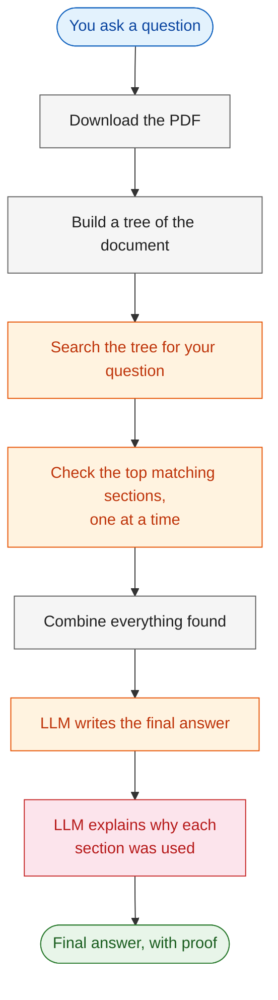
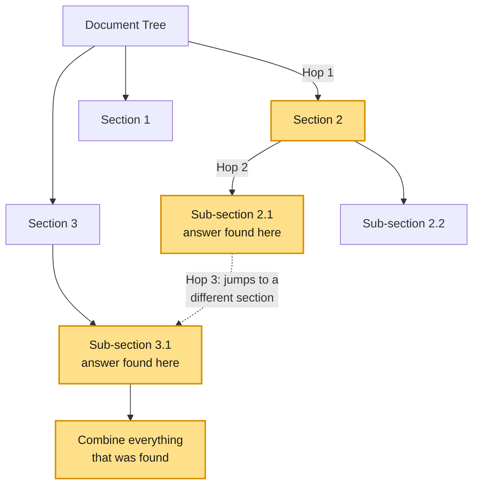
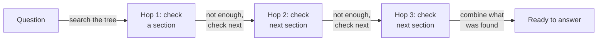

# Vectorless RAG: Multi-Hop Retrieval with Explainability Tracking

---

# Problem Statement / Use Case Overview

Some questions can't be answered from just one paragraph of a document. They need one number from one part of the document, and another number from a completely different part, so the two can be compared.

This lab handles exactly that. Instead of stopping at the first matching section, it **hops** from one relevant part of the document to the next — collecting pieces of information along the way — until it has everything it needs to answer the question fully.

**It works in three simple stages:**

1. **Build a tree of the document** — PageIndex reads the PDF and organizes it into sections, sub-sections, tables, and text.
2. **Hop across the tree** — Instead of picking just one section, the search checks the top few matching sections, one after another, and pulls the useful text from each.
3. **Answer with proof** — The LLM combines everything it found into one answer, and for every section it used, it also explains *why* that section mattered.

This is useful for things like:
- **Earnings reports** — comparing one figure to a related, adjusted version of it that lives in a separate table
- **Contracts** — where one section changes the meaning of a definition written somewhere else
- **Any question that needs pieces from more than one place in a document**

---

# Input Data

| Item | Detail |
|------|--------|
| **Your question** | A question that needs information from more than one section of the document |
| **The PDF** | A company's earnings release, downloaded automatically from a link — no need to have it saved beforehand |
| **PageIndex API Key** | Used to read the PDF and turn it into a tree, and to search that tree |
| **AWS Bedrock Credentials** | Used to connect to the LLM that reads the results and writes the answer |

---

# Processing

### The Full Flow



### What "Hopping" Looks Like

The search starts at the top of the document tree and works its way down, and it can even jump between two different sections if that's where the answer is:



### Checking Sections, One at a Time



---

# Output

A clear, plain-language answer that pulls from **more than one part** of the document, plus a full trail of where everything came from. For example:

> _"Metric A went down from X in one period to Y in the next. But metric B — a related figure from a separate section — actually went up, because it accounts for something metric A doesn't."_

Along with the answer, the lab also prints:
- **A list of the sections it checked**, in the order it checked them
- **A short explanation for each section** — the section name, which page it's from, whether it looks like it was used in the answer, and why it mattered

---

# Tech Stack

| Component | Tool |
|---|---|
| **Reading the document** | PageIndex — turns the PDF into a tree of sections |
| **Searching across sections** | PageIndex's search — checks the top matching sections one by one, no embeddings needed |
| **Writing the answer** | Amazon Nova Lite, through AWS Bedrock — reads the collected text and writes the answer, and also explains each section it used |
| **Connecting to the LLM** | LangChain (`langchain-aws`) |
| **Downloading the PDF** | `requests` — grabs the file from a link and saves it locally |

---

# Underlying Concepts (Summarized)

In a single-hop setup, the search picks just one or two relevant sections and answers from those. This lab goes a step further — it checks several top sections, one after another, and pulls useful text from each one before writing the answer. That's what "multi-hop" means here: hopping from section to section instead of stopping at the first good match.

This matters for questions that simply can't be answered from one place. For example, comparing a figure to a related, adjusted version of it often needs numbers from two separate tables in the report. Checking just one section would only give half the answer.

On top of that, this lab also explains itself. For every section it uses, it shows:
- Where that section came from (name, page number)
- Whether it looks like it was actually used in the final answer
- Why it was relevant, in the LLM's own words, based only on the text it retrieved

---

# Pre-requisites

- A PageIndex API key
- AWS Bedrock credentials (Access Key, Secret Key, Endpoint URL, Region)
- A basic idea of what an LLM is

---

# Environment / Dependencies Setup

First, install the packages this lab needs:

| Package | What it's for |
|---------|---------|
| `pageindex` | Reads the PDF, builds the tree, and searches across it |
| `langchain-aws` | Connects to the LLM through AWS Bedrock |
| `boto3` | Handles the AWS connection behind the scenes |
| `requests` | Downloads the PDF from a link |

```python
# Install the required libraries
!pip install pageindex langchain-aws boto3 requests
```

## Import Libraries

```python
# Core modules
import os
import time
import requests
import re

# PageIndex client for vectorless retrieval
from pageindex import PageIndexClient
import pageindex.utils as utils

# LangChain's AWS Bedrock wrapper
from langchain_aws import ChatBedrockConverse
```

## Add Your Keys

```python
# --- Configure AWS Bedrock credentials ---
os.environ["AWS_ACCESS_KEY_ID"]     = "YOUR_ACCESS_KEY_ID"
os.environ["AWS_SECRET_ACCESS_KEY"] = "YOUR_SECRET_ACCESS_KEY"
os.environ["AWS_ENDPOINT_URL"]      = "https://api.enterprisesi.co/api/v1/aws-genai/bedrock-runtime"
os.environ["AWS_REGION"]            = "ap-south-1"

print("Credentials configured.")

# --- Load PageIndex API Key ---
PAGEINDEX_API_KEY = input("Enter your PageIndex API key (get one at https://pageindex.ai): ").strip()
os.environ["PAGEINDEX_API_KEY"] = PAGEINDEX_API_KEY

print("PageIndex key loaded.")

# Initialize the PageIndex Client
pi_client = PageIndexClient(api_key=PAGEINDEX_API_KEY)
```

> 📝 **Note:** You'll find your keys under the key icon on the top right of the platform. Copy the API Key and Endpoint URL from there.

---

# Step-wise Instructions — Development

---

### Step 1 — Download the PDF

This time, instead of already having the file saved, the lab downloads it directly from a link and saves it locally.

```python
# Paste the direct link to the PDF you want to analyze
PDF_URL = "https://s21.q4cdn.com/736796105/files/doc_financials/2025/q4/Exhibit-99-1-Q4-2025-Earnings-Release.pdf"

# Save the PDF locally so it can be handed to PageIndex
os.makedirs("data", exist_ok=True)
PDF_PATH = os.path.join("data", PDF_URL.split("/")[-1])

response = requests.get(PDF_URL)
response.raise_for_status()
with open(PDF_PATH, "wb") as f:
    f.write(response.content)

print(f"Downloaded the document to '{PDF_PATH}'")
```

---

### Step 2 — Build the Document Tree

The PDF is sent to PageIndex, which reads it and organizes it into sections and sub-sections. This can take a little time, so the lab keeps checking until it's ready.

```python
# Submit the document to PageIndex — it builds a tree of sections, tables, and text
doc_info = pi_client.submit_document(PDF_PATH)
doc_id = doc_info["doc_id"]

print(f"Document Submitted. Tracking ID: {doc_id}")

# Wait until the document tree finishes building
print("Waiting for the document to be indexed...")
while not pi_client.is_retrieval_ready(doc_id):
    print("Still processing... checking again in 5 seconds.")
    time.sleep(5)

print("Indexing Complete! The hierarchical tree is ready for multi-hop retrieval.")
```

```python
tree = pi_client.get_tree(doc_id, node_summary=True)["result"]
print("Document Tree Structure:")
utils.print_tree(tree)
```

This prints out the tree PageIndex built — every section and table, with a short summary of what's inside. It's a good way to double-check everything looks right before asking any questions.

---

### Step 3 — Set Up the LLM

```python
# Set up the LLM
llm = ChatBedrockConverse(
    model="global.amazon.nova-2-lite-v1:0",
    temperature=0.0,
    max_tokens=300
)
```

This is the model that will read whatever gets found and write both the final answer and the explanations for each section used.

---

### Step 4 — Search the Tree, Section by Section

This is the main part of the lab. The question is sent to PageIndex, which searches the tree and returns the top matching sections. The lab then goes through those sections **one at a time**, and for each one, keeps track of exactly where it came from — the section name, its page number, and its own ID.

The lab also waits patiently while the search runs, and if it hits a temporary hiccup (like a rate limit), it just tries again instead of stopping.

```python
def retrieve_from_pageindex(query, doc_id, top_k=5):
    """
    Searches the document tree for the given query.
    Every piece of context returned here is tagged with:
      - which hop it was (1st match, 2nd match, ...)
      - the section title
      - the node id (the tree's unique ID for that section)
      - the page number(s) the text came from
    This metadata is what lets us later explain WHY a node was chosen.
    """
    response = pi_client.submit_query(doc_id=doc_id, query=query)
    retrieval_id = response.get("retrieval_id")

    if not retrieval_id:
        return []

    # Poll until the search finishes, retrying on errors
    while True:
        try:
            retrieval = pi_client.get_retrieval(retrieval_id)
            status = retrieval.get("status")
            if status == "completed":
                break
            elif status == "failed":
                return []
        except Exception as e:
            # Retry on rate limits or timeouts
            print(f"API rate limit or timeout during polling. Retrying... ({e})")

        time.sleep(3)

    nodes = retrieval.get("retrieved_nodes", [])
    hops = []

    for index, node in enumerate(nodes[:top_k]):
        node_name = node.get("title") or f"Section {index + 1}"
        node_id = node.get("id", "unknown")
        relevant_contents = node.get("relevant_contents", [])

        section_text = []
        page_numbers = []
        for group in relevant_contents:
            for item in group:
                content = item.get("relevant_content")
                if content:
                    section_text.append(content)

                # page number is embedded in a string like "<physical_index_6>"
                raw_page = item.get("physical_index", "")
                match = re.search(r"(\d+)", raw_page) if isinstance(raw_page, str) else None
                if match:
                    page_num = int(match.group(1))
                    if page_num not in page_numbers:
                        page_numbers.append(page_num)

        hops.append({
            "hop_number": index + 1,
            "section": node_name,
            "node_id": node_id,
            "pages": page_numbers,
            "text": "\n".join(section_text)
        })

    return hops
```

---

### Step 5 — Combine Everything and Ask the LLM

```python
def vectorless_rag(query, doc_id):
    hops = retrieve_from_pageindex(query, doc_id)

    if not hops:
        return "No relevant context found.", [], ""

    labeled_context = "\n\n".join(h["text"] for h in hops)

    prompt = f"""
You are a knowledgeable assistant. Answer the question below using only the context provided.
Give a direct, interpreted answer in plain language, the way an expert would explain it
to someone unfamiliar with the details — not a mechanical restatement of numbers. Consider
any relevant patterns, trends, or context clues rather than making a naive assumption
based on a single data point.

Context:
{labeled_context}

Question: {query}

Be concise in your answer.
"""

    response = llm.invoke(prompt)
    final_answer = response.content

    return final_answer, hops, labeled_context
```

This brings it all together: it gets the text from every section that was checked, joins it into one block, and asks the LLM for a direct, plain-language answer that considers relevant patterns and context rather than just restating numbers.

---

### Step 6 — Ask the Question

```python
# The question we want to ask
query = "What is CPKC's financial guidance for the full-year 2026 regarding core adjusted diluted EPS growth, volume growth, and capital expenditures?"
```

This kind of question — asking about several different figures at once — is a good fit for this lab, since the answer may need pulling context from more than one part of the report.

```python
print(f"Question: {query}\n")
print("Navigating document tree and generating answer...\n")

# Run the pipeline
final_answer, hops, labeled_context = vectorless_rag(query, doc_id)

print("--- SECTIONS SEARCHED (RETRIEVAL TRACE) ---")
for hop in hops:
    print(f"Hop {hop['hop_number']}: {hop['section']}")

print("\n--- FINAL ANSWER ---")
print(final_answer)
```

---

### Step 7 — See Why Each Section Was Used

For every section the lab checked, this prints where it came from, whether it looks like it was used in the answer, and — asking the LLM directly — why it mattered.

The "was it used" check here is a simple one: it just looks for the section's name inside the final answer. It's a good rough guide, but not perfect — for a more exact check, the answer-writing step would need to be changed to tag each fact with the section it came from.

```python
print("\n--- EXPLAINABILITY ---")
for hop in hops:
    pages = ", ".join(str(p) for p in hop["pages"]) if hop["pages"] else "unknown"

    # Simple check: does the section name appear in the final answer?
    was_used = hop["section"] in final_answer

    status = "LIKELY USED in answer" if was_used else "retrieved context"

    print(f"\nHop {hop['hop_number']}: \"{hop['section']}\"")
    print(f"node_id: {hop['node_id']} | page(s): {pages} | {status}")

    # Ask the LLM to explain why this hop matters
    explain_prompt = f"""
In 3-4 short lines, explain why the section below is relevant to the question.
Be specific -- mention the actual numbers or facts in the section that connect to the question.
Do not repeat the question. Do not add extra commentary.

Question: {query}

Section title: {hop['section']}
Section content: {hop['text']}
"""
    explanation_response = llm.invoke(explain_prompt)
    print(f"Why: {explanation_response.content.strip()}")
```

---

# What We Learnt

This lab checks several sections of a document instead of just one, and explains exactly where each part of the answer came from.

- **It hops across sections** instead of stopping at the first match — useful when an answer needs numbers or facts from more than one place.
- **PageIndex handles the searching** — no embeddings or vector database needed.
- **Every answer comes with a trail** — which sections were checked, which pages they're from, and why each one mattered.
- **It's built to handle hiccups** — if the search runs into a temporary error, it just tries again instead of stopping.
- **The PDF is downloaded automatically** — no need to have it saved on your computer beforehand.