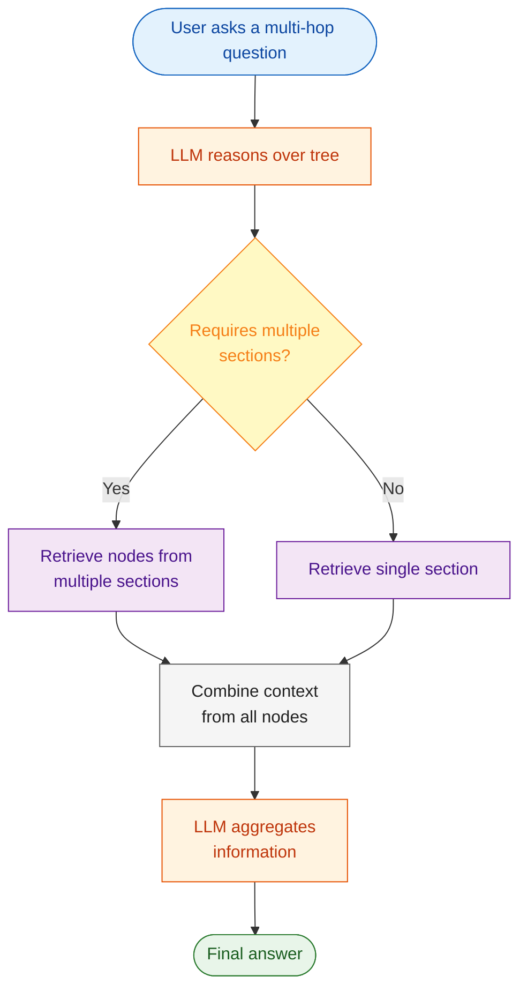
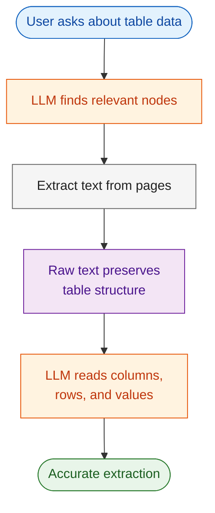
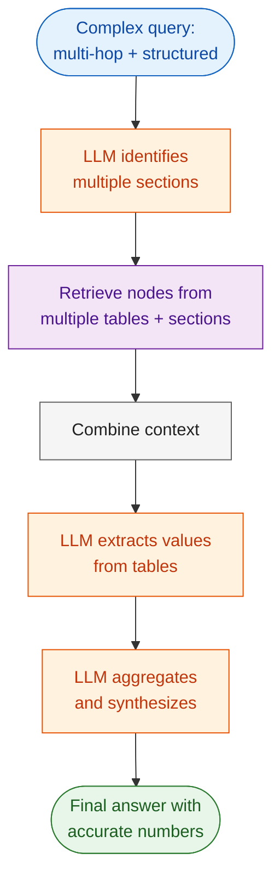
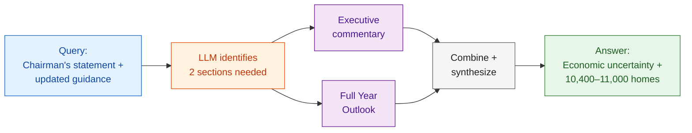
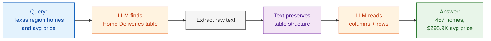

# 1. Lab Title

## Vectorless RAG — Advanced Scenarios

# What is Vectorless RAG?

**Vectorless RAG** replaces embeddings, vector stores, and text chunking with a single idea: let a Language Model (LLM) *reason over a document tree* and then *read the extracted text* from relevant pages.

This lab focuses on two advanced scenarios where Vectorless RAG excels:

1. **Multi-Hop Attribute Aggregation** — Questions that require combining information from multiple sections of a document.
2. **Structured Data Fidelity** — Extracting accurate values from tables, forms, and structured data.

# 2. Problem Statement / Use Case Overview

## Scenario 1: Multi-Hop Attribute Aggregation

**Problem:** Some questions cannot be answered from a single section. For example, asking about the Executive Chairman's statement on slower spring selling season AND the updated full-year home delivery guidance requires finding:
- The executive commentary section (Section A)
- The full-year outlook section (Section B)
- Combining both pieces of information

Traditional RAG retrieves chunks by similarity — it might find Section A OR Section B, but not both.

**Solution:** Vectorless RAG uses tree-based reasoning to identify that the answer requires **multiple sections**, then aggregates the information.

## Scenario 2: Structured Data Fidelity

**Problem:** Documents contain tables, forms, and structured data. Extracting this data accurately is critical — a wrong number can be costly. For example, extracting the exact number of homes delivered and average sales price for a specific region from a table.

**Solution:** The LLM reads the raw text (which preserves table structure) and extracts values with high fidelity, understanding column headers and row labels from context.

# 3. Input Data

| Item | Detail |
|------|--------|
| User query | Natural-language question about a PDF document |
| PDF document | Century Communities Q1 2025 Earnings Release (`data/CCS 3.31.25 Earnings Release 8-K Exhibit 99.1.pdf`) |
| PageIndex API Key | Used to parse the PDF into a hierarchical tree |
| OpenRouter API Key | Used to call the Language Model (Llama 4 Scout) |

# 4. Processing

## Multi-Hop Aggregation Flow



## Structured Data Fidelity Flow



## Combined Flow



1. The **PageIndex API** parses the PDF into a tree of sections and subsections.
2. The **LLM** reasons over the tree to identify which sections are needed, documenting its hop-by-hop traversal path.
3. For multi-hop queries, the LLM retrieves **multiple nodes** from different sections.
4. For structured data, the LLM reads the raw text and **extracts values accurately**.
5. The LLM **aggregates information** and provides a final answer.
6. A **traversal visualization** shows the reasoning path through the document tree.

# 5. Output

### Multi-Hop Example
> _"The Executive Chairman, Dale Francescon, stated that economic uncertainty, interest rate volatility, and decline in consumer confidence contributed to a slower than typical spring selling season. The updated full-year home delivery guidance range is 10,400 to 11,000 homes."_

### Structured Data Example
> _"In the first quarter of 2025, the 'Texas' region delivered 457 homes with an average sales price of $298.9 thousand."_

# 6. Tech Stack

| Layer | Technology |
|-------|------------|
| LLM | Llama 4 Scout via OpenRouter |
| Document Parsing | PageIndex API |
| PDF Text Extraction | PyMuPDF (`pymupdf`) |
| LLM Client | OpenAI SDK (compatible with OpenRouter) |
| Language | Python 3.12 |
| Runtime | Jupyter Notebook |

# 7. Underlying Concepts

## Multi-Hop Attribute Aggregation
- **Definition:** Combining information from multiple document sections to answer a single question.
- **Challenge:** Traditional RAG retrieves chunks by similarity — it may miss related sections.
- **Solution:** Tree-based reasoning allows the LLM to identify that the answer requires multiple sources.

## Structured Data Fidelity
- **Definition:** Extracting accurate values from tables, forms, and structured data.
- **Challenge:** PDF table extraction often loses formatting; wrong values can be costly.
- **Solution:** Raw text preserves table structure (column headers, row labels), allowing accurate extraction.

## Why Vectorless RAG Excels Here
- **No chunking** — the LLM reads complete sections, not arbitrary chunks.
- **Reasoning over similarity** — the LLM understands that a question requires multiple sources.
- **Text preservation** — raw text maintains table structure better than extracted data.
- **Traversal visualization** — the reasoning path through the document tree can be visualized.

> Refer to the original implementation: [Clement-Okolo/Vectorless-Rag](https://github.com/Clement-Okolo/Vectorless-Rag)

# 8. Pre-requisites

- Basic familiarity with Python (functions, `import` statements).
- Completion of Lab 1 (Vectorless RAG basics).
- **PageIndex API Key** — sign up at [pageindex.ai](https://pageindex.ai).
- **OpenRouter API Key** — sign up at [openrouter.ai](https://openrouter.ai).
- Understanding of what multi-hop reasoning means in the context of RAG.

# 9. Environment / Dependencies Setup

## Install Dependencies

The cell below installs all required Python packages:

| Package | Purpose |
|---------|---------|
| `pageindex` | Document tree generation and retrieval via PageIndex API |
| `openai` | LLM client (used with OpenRouter's OpenAI-compatible endpoint) |
| `python-dotenv` | Load API keys from `.env` file |
| `pymupdf` | Extract text from PDF pages |

Run this cell first — it only needs to be run once per session.

```python
!pip install -q pageindex openai python-dotenv pymupdf
```

## Import Libraries

Import the standard library and third-party modules used throughout the notebook. `os` and `json` handle file paths and caching. `re` parses JSON from LLM responses. `pymupdf` extracts text from PDFs. `OpenAI` is the LLM client. `load_dotenv` loads API keys from the `.env` file.

```python
import os
import json
import re
import pymupdf
from openai import OpenAI
from dotenv import load_dotenv
```

## Load API Keys

Load API keys from the `.env` file in the project root (`../.env` relative to this notebook). If either key is missing from `.env`, you'll be prompted to enter it manually.

```python
load_dotenv("../.env")

PAGEINDEX_API_KEY = os.getenv("PAGEINDEX_API_KEY")
OPENROUTER_API_KEY = os.getenv("OPENROUTER_API_KEY")

# If keys are missing, prompt the user to enter them
if not PAGEINDEX_API_KEY:
    PAGEINDEX_API_KEY = input("Enter your PageIndex API key (get one at https://pageindex.ai): ").strip()
if not OPENROUTER_API_KEY:
    OPENROUTER_API_KEY = input("Enter your OpenRouter API key (get one at https://openrouter.ai): ").strip()

print("Keys loaded.")
```

## Set Up the LLM

### `call_llm(prompt, model)`

Sends a prompt to the LLM via OpenRouter and returns the response text. Creates a fresh OpenAI client pointed at OpenRouter's API endpoint. Uses `meta-llama/llama-4-scout-17b-16e-instruct` by default with `temperature=0` for deterministic output.

```python
def call_llm(prompt, model="meta-llama/llama-4-scout-17b-16e-instruct"):
    client = OpenAI(base_url="https://openrouter.ai/api/v1", api_key=OPENROUTER_API_KEY)
    return client.chat.completions.create(
        model=model, messages=[{"role": "user", "content": prompt}], temperature=0, max_tokens=1024
    ).choices[0].message.content.strip()
```

---

## Load and Parse the PDF

Extract text from each page of the PDF using PyMuPDF. This text will be used as context for the LLM when answering questions.

### Define PDF Path

Point this to any PDF you want to query.

```python
PDF_PATH = "data/CCS 3.31.25 Earnings Release 8-K Exhibit 99.1.pdf"
```

### Extract Text from PDF

Opens the PDF with PyMuPDF and builds a dictionary mapping 1-based page numbers to their extracted text. The raw text preserves table structure (column headers, row labels) which is critical for accurate data extraction.

```python
doc = pymupdf.open(PDF_PATH)
page_texts = {i+1: doc.load_page(i).get_text() for i in range(len(doc))}
doc.close()
print(f"Extracted text from {len(page_texts)} pages.")
```

---

## Build Document Tree (with caching)

The PageIndex API parses the PDF into a hierarchical tree of sections and subsections. The tree is cached as JSON so repeat runs with the same PDF skip the API call.

### Set Up Caching and PageIndex

Import the PageIndex client and define the cache path. The cache file is named after the PDF filename with `_tree.json` appended.

```python
from pageindex import PageIndexClient
from pageindex import utils
import time

CACHE_PATH = f"cache/{os.path.basename(PDF_PATH).replace('.pdf', '_tree.json')}"
os.makedirs("cache", exist_ok=True)
```

### Load or Build the Tree

Try loading from cache first. If it's a cache miss, submit the PDF to PageIndex, poll until processing completes (up to 5 minutes), save the result to cache, and display the tree structure.

```python
tree = None
if os.path.exists(CACHE_PATH):
    with open(CACHE_PATH) as f:
        tree = json.load(f)
    print("Loaded tree from cache.")

if tree is None:
    pi = PageIndexClient(api_key=PAGEINDEX_API_KEY)
    result = pi.submit_document(PDF_PATH)
    doc_id = result["doc_id"]
    print(f"Submitted: {doc_id}")

    elapsed = 0
    while elapsed < 300:
        if pi.is_retrieval_ready(doc_id):
            break
        time.sleep(5)
        elapsed += 5
        print(f"  {elapsed}s...")
    else:
        raise TimeoutError("PageIndex timeout")

    tree = pi.get_tree(doc_id, node_summary=True)["result"]
    with open(CACHE_PATH, "w") as f:
        json.dump(tree, f, indent=2)
    print("Tree cached.")

utils.print_tree(tree, exclude_fields=["text"])
```

---

## Helper Functions

Reusable functions for retrieving nodes and building context from the document tree.

### `parse_json(text)`

Extracts and robustly parses JSON from the LLM's response text. Handles markdown code fences (```` ```json ... ``` ````) that LLMs often wrap around JSON output, locates the outermost curly braces, and parses the inner JSON. Falls back to regex extraction of `thinking` and `node_list` fields if `json.loads` fails due to unescaped characters in the LLM output.

```python
def parse_json(text):
    """Extract and robustly parse JSON from LLM response, ignoring extra text."""
    text = re.sub(r"```json\s*|\s*```", "", text.strip())
    
    # Locate the outermost curly braces
    s = text.find("{")
    
    # Walk backward from the end to find the true matching closing brace for the JSON object
    # This prevents catching trailing text as part of the JSON payload
    e = text.rfind("}")
    
    if s != -1 and e != -1:
        text = text[s:e+1]
        
    try:
        return json.loads(text)
    except json.JSONDecodeError:
        pass
    
    # Fallback: extract thinking and node_list with regex when JSON is malformed
    thinking = ""
    m_think = re.search(r'"thinking"\s*:\s*"((?:[^"\\]|\\.)*)"', text, re.DOTALL)
    if m_think:
        thinking = m_think.group(1)
    
    node_list = []
    m_nodes = re.search(r'"node_list"\s*:\s*\[(.*?)\]', text, re.DOTALL)
    if m_nodes:
        node_list = re.findall(r'"(\d+)"', m_nodes.group(1))
    
    return {"thinking": thinking, "node_list": node_list}
```

### `retrieve_nodes(query)`

Uses the LLM to find relevant nodes for a given query with multi-hop reasoning. Strips full text from the tree (keeping only titles + summaries), sends it to the LLM with the question, and returns the parsed JSON result containing a step-by-step traversal path (hops) and a list of relevant node IDs. This is the core retrieval function that enables tree-based reasoning.

```python
def retrieve_nodes(query):
    """Use LLM to find relevant nodes and map the hop-by-hop traversal with titles."""
    tree_slim = utils.remove_fields(tree.copy(), fields=["text"])
    prompt = f"""
Given a question and a document tree, find nodes likely to contain the answer.
You must perform multi-hop reasoning. Document your exact step-by-step traversal path.

Question: {query}

Tree:
{json.dumps(tree_slim, indent=2)}

JSON only:
{{
  "hops": [
    {{"step": 1, "node_id": "id1", "section_title": "Name of the table or section", "reason": "Looked here first because..."}},
    {{"step": 2, "node_id": "id2", "section_title": "Name of the next table", "reason": "Then realized I needed X..."}}
  ],
  "node_list": ["id1", "id2"]
}}
"""
    return parse_json(call_llm(prompt))
```

### `get_context(node_list)`

Extracts text from pages covered by the given node list. Maps each node ID to its page range, collects the extracted text from those pages (deduplicating), and joins them with page separators. Returns a single string of all relevant page text.

```python
def get_context(node_list):
    """Extract text from pages covered by the given nodes."""
    node_map = utils.create_node_mapping(tree, include_page_ranges=True, max_page=len(page_texts))
    texts, seen = [], set()
    for nid in node_list:
        info = node_map[nid]
        for p in range(info["start_index"], info["end_index"] + 1):
            if p not in seen and p in page_texts:
                texts.append(f"--- Page {p} ---\n{page_texts[p]}")
                seen.add(p)
    return "\n\n".join(texts)
```

### `plot_traversal(hops)`

Visualizes the LLM's multi-hop reasoning path as a directed graph using `networkx` and `matplotlib`. Shows the user query as the starting point and each hop as a node in the traversal chain, with edges connecting consecutive steps.

```python
import networkx as nx
import matplotlib.pyplot as plt

def plot_traversal(hops):
    """Draws a visual graph of the LLM's multi-hop reasoning path."""
    G = nx.DiGraph()
    
    # Define the starting point
    G.add_node("User Query", color="#e3f2fd") # Light blue
    
    node_colors = ["#e3f2fd"]
    pos = {"User Query": (0, 1)}
    
    # Build the path
    for i, hop in enumerate(hops):
        label = f"Hop {hop['step']}:\nNode {hop['node_id']}"
        G.add_node(label, color="#fff3e0") # Light orange
        node_colors.append("#fff3e0")
        
        # Connect to the previous step (or query if it is the first step)
        if i == 0:
            G.add_edge("User Query", label)
        else:
            prev_label = f"Hop {hops[i-1]['step']}:\nNode {hops[i-1]['node_id']}"
            G.add_edge(prev_label, label)
            
        # Layout positioning
        pos[label] = (i + 1, i % 2) # Staggers them slightly for a "hopping" look
        
    # Draw the graph
    plt.figure(figsize=(10, 4))
    nx.draw(G, pos, with_labels=True, node_color=node_colors, 
            node_size=4000, font_size=9, font_weight="bold", 
            edge_color="#616161", arrows=True, arrowsize=20)
    
    plt.title("Vectorless RAG : Reasoning Path", fontsize=14)
    plt.margins(0.2)
    plt.show()
```

---

# Scenario 1: Multi-Hop Attribute Aggregation



### Define Multi-Hop Query

Set a question that requires information from multiple document sections to answer.

```python
# Change this to a question that requires info from multiple sections
QUERY_MULTI_HOP = "What did the Executive Chairman say was the cause of the slower spring selling season, and what is the new updated full-year home delivery guidance range?"
```

### Retrieve Nodes for Multi-Hop Query

Send the query to the LLM to identify which nodes are relevant. For multi-hop questions, the LLM should return nodes from multiple sections and document its traversal path.

```python
result = retrieve_nodes(QUERY_MULTI_HOP)

print("--- RAG Traversal Path ---")
for hop in result["hops"]:
    print(f"Hop {hop['step']} (Node {hop['node_id']}): {hop['reason']}")

print("\nFinal Nodes Retrieved:", result["node_list"])
```

Expected output:
```
--- RAG Traversal Path ---
Hop 1 (Node 0000): Initial overview of Century Communities' Q1 2025 results
Hop 2 (Node 0003): Contains the Full Year 2025 Outlook and updated home delivery guidance

Final Nodes Retrieved: ['0000', '0003']
```

### Answer Multi-Hop Query

Build context from the retrieved nodes and send it to the LLM with the question to get the final answer.

```python
context = get_context(result["node_list"])
answer = call_llm(f"Context:\n{context}\n\nQuestion: {QUERY_MULTI_HOP}\n\nAnswer concisely.")
print("Answer:", answer)
```

Expected output:
```
Answer: The Executive Chairman, Dale Francescon, stated that economic uncertainty, interest rate volatility, and decline in consumer confidence contributed to a slower than typical spring selling season. 
The updated full-year home delivery guidance range is 10,400 to 11,000 homes.
```

### Visualize the Traversal Path

```python
# Call the function with our results
plot_traversal(result["hops"])
```

### Why Multi-Hop is Hard

Traditional RAG retrieves chunks by similarity. A query about the Chairman's statement AND updated guidance might only match the commentary section OR the outlook section — not both. Vectorless RAG with tree-based reasoning can identify that the answer requires **multiple sections**.

---

# Scenario 2: Structured Data Fidelity



### Define Structured Data Query

Set a question about extracting specific values from a table in the document.

```python
# Change this to a question about extracting specific values from a table
QUERY_STRUCTURED = "According to the Home Deliveries table, what was the exact number of homes delivered and the average sales price for the 'Texas' region in the first quarter of 2025?"
```

### Retrieve Nodes for Structured Data

Find the nodes containing the relevant table or structured data.

```python
result = retrieve_nodes(QUERY_STRUCTURED)

print("--- Table Analysis Path (Structured Data) ---")
for step in result["hops"]:
    print(f"Step {step['step']} (Table Node {step['node_id']}): {step['reason']}")

print("\nFinal Nodes Retrieved:", result["node_list"])
```

Expected output:
```
--- Table Analysis Path (Structured Data) ---
Step 1 (Table Node 0000): Started with the main report to understand the context of Century Communities' Q1 2025 results.
Step 2 (Table Node 0001): Moved to the detailed Q1 2025 results to find specific operational metrics.
Step 3 (Table Node 0009): Navigated to the Home Deliveries section for detailed information on home deliveries.
Step 4 (Table Node 0008): Checked the Net New Home Contracts section for regional breakdowns, realizing it might contain or lead to the necessary home deliveries data.

Final Nodes Retrieved: ['0000', '0001', '0009', '0008']
```

### Answer Structured Data Query

Extract the page text from the retrieved nodes and have the LLM read the raw table data to produce an accurate answer.

```python
context = get_context(result["node_list"])
answer = call_llm(f"Context:\n{context}\n\nQuestion: {QUERY_STRUCTURED}\n\nAnswer concisely.")
print("Answer:", answer)
```

Expected output:
```
Answer: In the first quarter of 2025, the 'Texas' region delivered 457 homes with an average sales price of $298.9 thousand.
```

### Visualize the Traversal Path

```python
# Generate the visual plot for the table extraction
plot_traversal(result["hops"])
```

### Why Structured Data Fidelity Matters

Tables in PDFs are often poorly formatted when extracted. Vectorless RAG preserves the original text flow, allowing the LLM to understand table structure from context (column headers, row labels, etc.).

---

## Try It Yourself

Change the `QUERY_*` variables and re-run the cells. Here are some generic patterns to try:

| Scenario | Example Question |
|----------|------------------|
| Multi-Hop | "What was the net income and how does it compare to the prior year period?" |
| Structured Data | "What is the number of net new home contracts for the West region?" |
| Multi-Hop + Table | "What were the total homebuilding gross margins and how do they break down by region?" |
