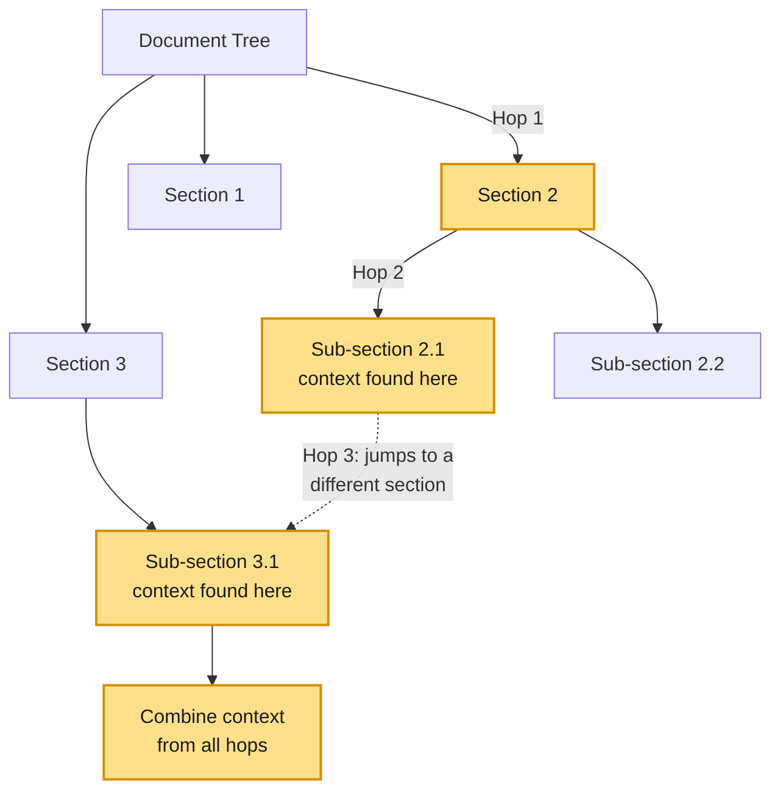
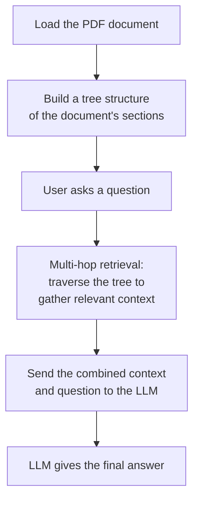
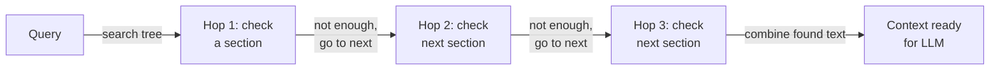

# Vectorless RAG — Multi-Hop Retrieval

## What is Multi-Hop Retrieval?

**Multi-hop retrieval** works differently, instead of chunks and embeddings, the document is organized into a **tree** (sections, sub-sections, tables, text). When a question comes in, the search doesn't stop at the first match — it "hops" from one relevant part of the tree to the next, picking up context along the way, until it has gathered enough pieces to actually answer the question.

This is useful for questions that can't be answered from a single paragraph — for example, a question that needs a number from one section and a target from another section, to compare them.

Here's what that hopping looks like on the actual document tree — instead of jumping straight to an answer, the search walks down from the top level, one level at a time, until it lands on the exact content it needs:



## How We're Going to Implement It

The diagram below is the high-level picture of the whole notebook, from PDF to final answer.



---

## Walking Through the Notebook

### Setup

#### Install Dependencies
```python
# Install PageIndex for vectorless hierarchical retrieval, LangChain Groq for the LLM, and requests for downloading the file.
!pip install pageindex langchain-groq requests dotenv 
```
This installs the tree-based retrieval library, the LLM wrapper, and `requests` for handling files.

#### Import Libraries
```python
# Import core modules
import os
import time
import requests
import re

# Import PageIndex for vectorless retrieval
from pageindex import PageIndexClient
import pageindex.utils as utils
from dotenv import load_dotenv

# Import LangChain's Groq wrapper
from langchain_groq import ChatGroq
```
Brings in the retrieval client, a helper to load environment variables (like API keys), and the LLM wrapper we'll use later.

#### Setup API Keys
```python
load_dotenv("../.env")

PAGEINDEX_API_KEY = os.getenv("PAGEINDEX_API_KEY")

# Initialize the PageIndex Client
pi_client = PageIndexClient(api_key=PAGEINDEX_API_KEY)
```
Loads the API key from an `.env` file and creates the client we'll use to build and search the document tree.

---

### Load and Parse the PDF

#### Define PDF Path
```python
import os

# Point to the local PDF document you already have
PDF_PATH = "data/CCS 3.31.25 Earnings Release 8-K Exhibit 99.1.pdf"

# Let's add a quick beginner-friendly check to make sure the file exists where we expect it
if os.path.exists(PDF_PATH):
    print(f"Success: Found the document at '{PDF_PATH}'")
else:
    print(f"Error: Could not find the document. Please make sure the 'data' folder is in the same directory as this notebook.")
```
A simple check to make sure the PDF is actually where the notebook expects it, before we try to do anything with it.

#### Submit and Index Document (Tree Construction)
```python
# Submit your local document to PageIndex. 
# It reads your financial document and organizes it into a logical tree (Sections, Tables, Text).
doc_info = pi_client.submit_document(PDF_PATH)
doc_id = doc_info["doc_id"]

print(f"Document Submitted. Tracking ID: {doc_id}")

# Polling loop: Wait for the document tree to finish building
print("Waiting for the document to be indexed...")
while not pi_client.is_retrieval_ready(doc_id):
    print("Still processing... checking again in 5 seconds.")
    time.sleep(5)

print("Indexing Complete! The hierarchical tree is ready for multi-hop retrieval.")
```
This is the step where the PDF is turned into a tree. The document is submitted, and the notebook waits (polling every 5 seconds, printing a status update each time) until the tree is fully built and ready to be searched.

#### Print the Document Tree
```python
tree = pi_client.get_tree(doc_id, node_summary=True)["result"]
print("Document Tree Structure:")
utils.print_tree(tree)
```
Once the tree is ready, this pretty-prints the actual hierarchical structure PageIndex built from the PDF — every section, sub-section, and table as a node, with a short summary of what each one contains. It's a nice sanity check before running any queries: you can see exactly what the retrieval function will be searching over.

#### Initialize the LLM
```python
# Initialize the LLM
llm = ChatGroq(
    model="...", 
    temperature=0.0,
    max_tokens=300  
)
```
Sets up the LLM that will later read the retrieved context and generate the final answer.

---

### Define Retrieval Function (Multi-Hop, With Explainability Tracking)

This is the core of the multi-hop logic — the function sends the question to the tree, waits for the search to finish, then walks through the top matching sections **one at a time**. For each one, it records not just the text, but exactly *where* that text came from: the section title, the node's unique ID, and the page number(s). This metadata is what makes the retrieval explainable later.



```python
def retrieve_from_pageindex(query, doc_id, top_k=5):
    """
    Searches the document tree for the given query.
    Every piece of context returned here is tagged with:
      - which hop it was (1st match, 2nd match, ...)
      - the section title
      - the node id (the tree's unique ID for that section)
      - the page number(s) the text came from
    This metadata is what lets us later explain WHY a node was chosen.
    """
    response = pi_client.submit_query(doc_id=doc_id, query=query)
    retrieval_id = response.get("retrieval_id")

    if not retrieval_id:
        return []

    while True:
        retrieval = pi_client.get_retrieval(retrieval_id)
        status = retrieval.get("status")
        if status == "completed":
            break
        elif status == "failed":
            return []
        time.sleep(1)

    nodes = retrieval.get("retrieved_nodes", [])
    hops = []

    for index, node in enumerate(nodes[:top_k]):
        node_name = node.get("title") or f"Section {index + 1}"
        node_id = node.get("id", "unknown")   
        relevant_contents = node.get("relevant_contents", [])

        section_text = []
        page_numbers = []
        for group in relevant_contents:
            for item in group:
                content = item.get("relevant_content")
                if content:
                    section_text.append(content)

                # page number is embedded in a string like "<physical_index_6>"
                raw_page = item.get("physical_index", "")
                match = re.search(r"(\d+)", raw_page) if isinstance(raw_page, str) else None
                if match:
                    page_num = int(match.group(1))
                    if page_num not in page_numbers:
                        page_numbers.append(page_num)

        hops.append({
            "hop_number": index + 1,
            "section": node_name,
            "node_id": node_id,
            "pages": page_numbers,
            "text": "\n".join(section_text)
        })

    return hops
```

**What's happening here, step by step:**
1. The query is submitted to the document tree.
2. The notebook polls until the search is marked `completed`.
3. It loops through the top `top_k` matching sections **serially** (one after another) — this is the "hop."
4. For each hop, it pulls out the readable text, the node's ID, and its page number(s) (using a small regex, since PageIndex embeds the page inside a string like `"<physical_index_6>"` rather than as a plain number).
5. It returns a structured list of hops — each one knowing exactly which section, node, and page it came from.

#### Combine Context and Ask the LLM
```python
def vectorless_rag(query, doc_id):
    hops = retrieve_from_pageindex(query, doc_id)

    if not hops:
        return "No relevant context found.", [], ""

    labeled_context = "\n\n".join(h["text"] for h in hops)

    prompt = f"""
You are a financial analyst. Answer the question below using only the context provided.
Give a direct, interpreted answer in plain language, the way an analyst would explain it
to someone in a meeting — not a mechanical calculation. Consider seasonality and other
relevant signals in the context (like backlog or order trends) rather than just scaling
one quarter's number by 4.

Context:
{labeled_context}

Question: {query}
"""

    response = llm.invoke(prompt)
    final_answer = response.content

    return final_answer, hops, labeled_context
```
This ties it together — it calls the hop-by-hop retrieval function, combines the retrieved text into one block of context, and asks the LLM for a plain-language, interpreted answer rather than a mechanical calculation. The prompt steers it away from naive annualization (e.g. multiplying a quarterly number by 4) and toward weighing seasonality, backlog, and order trends where relevant.

---

### Run Query and Show the Tracking

#### Define the Question
```python
# The question we want to ask
query = "How much did GAAP net income grow or shrink from Q1 2024 to Q1 2025? Separately, what was adjusted net income (not adjusted EBITDA) for both periods, and does it tell a different story?"
```
This is a good test question for multi-hop retrieval because the answer needs two different numbers from two different sections — GAAP net income (Consolidated Statements of Operations) and adjusted net income (the Non-GAAP Reconciliation table).

#### Run the Pipeline and Print the Trace + Answer
```python
print(f"Question: {query}\n")
print("Navigating document tree and generating answer...\n")

# Run the pipeline
final_answer, hops, labeled_context = vectorless_rag(query, doc_id)

# --- SECTIONS SEARCHED (RETRIEVAL TRACE) ---
print("--- SECTIONS SEARCHED (RETRIEVAL TRACE) ---")
for hop in hops:
    print(f"Hop {hop['hop_number']}: {hop['section']}")

# --- FINAL ANSWER ---
print("\n--- FINAL ANSWER ---")
print(final_answer)
```
Runs the whole pipeline, then prints the question, which sections were searched, and the final answer.

#### Print the Explainability Report
```python
print("\n--- EXPLAINABILITY ---")
for hop in hops:
    pages = ", ".join(str(p) for p in hop["pages"]) if hop["pages"] else "unknown"
    was_used = hop["hop_number"] 
    status = "USED in answer" if was_used else "retrieved but NOT used"

    print(f"\nHop {hop['hop_number']}: \"{hop['section']}\"")
    print(f"node_id: {hop['node_id']} | page(s): {pages} | {status}")

    # Ask the LLM directly, right here, why this hop is relevant --
    # no helper function, built inline for each hop.
    # Note: this is a generated explanation, not PageIndex's internal
    # scoring (the API doesn't expose that), but it's grounded in the
    # actual retrieved content, not made up.
    explain_prompt = f"""
In 3-4 short lines, explain why the section below is relevant to the question.
Be specific -- mention the actual numbers or facts in the section that connect to the question.
Do not repeat the question. Do not add extra commentary.

Question: {query}

Section title: {hop['section']}
Section content: {hop['text']}
"""
    explanation_response = llm.invoke(explain_prompt)
    print(f"Why: {explanation_response.content.strip()}")
```
For every retrieved hop, this prints:
- **Where** it came from — section title, node ID, and page number(s)
- **Whether** it was used in the final answer
- **Why** it's relevant — a short, grounded explanation generated by asking the LLM to justify the section against the question, using only the real retrieved text (not PageIndex's internal scoring, which isn't exposed by the API).