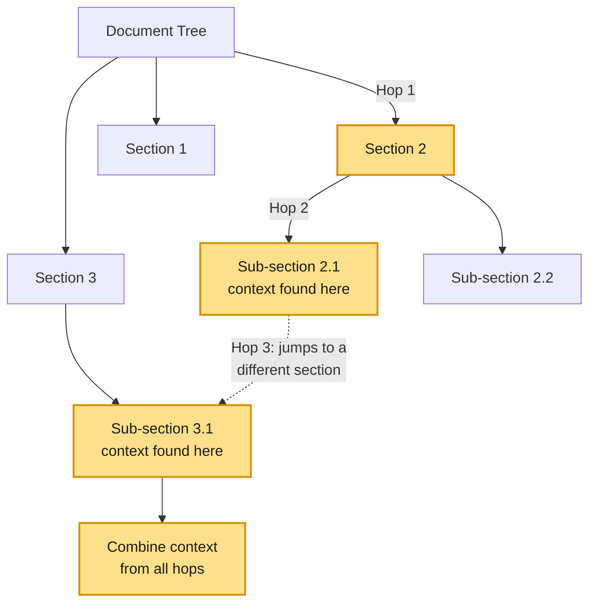
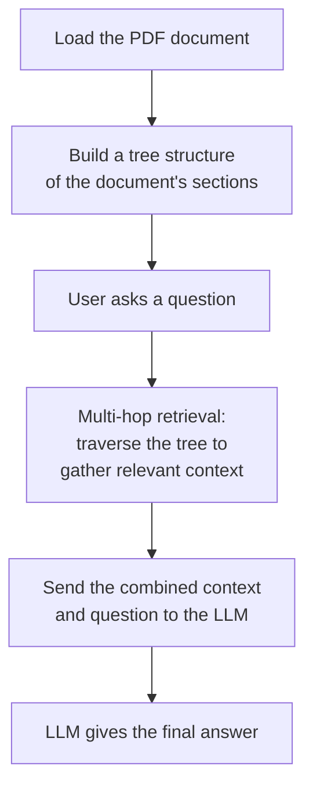
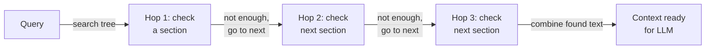

# Vectorless RAG — Multi-Hop Retrieval

## What is Multi-Hop Retrieval?

**Multi-hop retrieval** works differently, instead of chunks and embeddings, the document is organized into a **tree** (sections, sub-sections, tables, text). When a question comes in, the search doesn't stop at the first match — it "hops" from one relevant part of the tree to the next, picking up context along the way, until it has gathered enough pieces to actually answer the question.

This is useful for questions that can't be answered from a single paragraph — for example, a question that needs a number from one section and a target from another section, to compare them.

Here's what that hopping looks like on the actual document tree — instead of jumping straight to an answer, the search walks down from the top level, one level at a time, until it lands on the exact content it needs:



## How We're Going to Implement It

The diagram below is the high-level picture of the whole notebook, from PDF to final answer.



---

## Walking Through the Notebook

### Setup

#### Install Dependencies
```python
!pip install pageindex langchain-groq requests dotenv
```
This installs the tree-based retrieval library, the LLM wrapper, and `requests` for handling files.

#### Import Libraries
```python
import os
import time
import requests

from pageindex import PageIndexClient
import pageindex.utils as utils
from dotenv import load_dotenv

from langchain_groq import ChatGroq
```
Brings in the retrieval client, a helper to load environment variables (like API keys), and the LLM wrapper we'll use later.

#### Setup API Keys
```python
load_dotenv("../.env")
PAGEINDEX_API_KEY = os.getenv("PAGEINDEX_API_KEY")
pi_client = PageIndexClient(api_key=PAGEINDEX_API_KEY)
```
Loads the API key from an `.env` file and creates the client we'll use to build and search the document tree.

---

### Load and Parse the PDF

#### Define PDF Path
```python
PDF_PATH = "data/CCS 3.31.25 Earnings Release 8-K Exhibit 99.1.pdf"

if os.path.exists(PDF_PATH):
    print(f"Success: Found the document at '{PDF_PATH}'")
else:
    print(f"Error: Could not find the document...")
```
A simple check to make sure the PDF is actually where the notebook expects it, before we try to do anything with it.

#### Submit and Index Document (Tree Construction)
```python
doc_info = pi_client.submit_document(PDF_PATH)
doc_id = doc_info["doc_id"]

while not pi_client.is_retrieval_ready(doc_id):
    time.sleep(5)
```
This is the step where the PDF is turned into a tree. The document is submitted, and the notebook waits (polling every 5 seconds) until the tree is fully built and ready to be searched.

#### Print the Document Tree
```python
tree = pi_client.get_tree(doc_id, node_summary=True)["result"]
print("Document Tree Structure:")
utils.print_tree(tree)
```
Once the tree is ready, this pretty-prints the actual hierarchical structure PageIndex built from the PDF — every section, sub-section, and table as a node, with a short summary of what each one contains. It's a nice sanity check before running any queries: you can see exactly what the retrieval function will be searching over.

#### Initialize the LLM
```python
llm = ChatGroq(
    model="...", 
    temperature=0.0,
    max_tokens=300  
)
```
Sets up the LLM that will later read the retrieved context and generate the final answer.

---

### Define Retrieval Function (Multi-Hop, Tagged for Explainability)

This is the core of the multi-hop logic — the function sends the question to the tree, waits for the search to finish, then walks through the top matching sections **one at a time**. For each one, it records not just the text, but exactly *where* that text came from: the section title, the node's unique ID, and the page number(s). This metadata is what makes the retrieval explainable later.



```python
def retrieve_from_pageindex(query, doc_id, top_k=3):
    response = pi_client.submit_query(doc_id=doc_id, query=query)
    retrieval_id = response.get("retrieval_id")

    if not retrieval_id:
        return []

    while True:
        retrieval = pi_client.get_retrieval(retrieval_id)
        status = retrieval.get("status")
        if status == "completed":
            break
        elif status == "failed":
            return []
        time.sleep(1)

    nodes = retrieval.get("retrieved_nodes", [])
    hops = []

    for index, node in enumerate(nodes[:top_k]):
        node_name = node.get("title") or f"Section {index + 1}"
        node_id = node.get("id", "unknown")  # PageIndex returns the node's ID under "id"
        relevant_contents = node.get("relevant_contents", [])

        section_text = []
        page_numbers = []
        for group in relevant_contents:
            for item in group:
                content = item.get("relevant_content")
                if content:
                    section_text.append(content)

                # page number is embedded in a string like "<physical_index_6>"
                raw_page = item.get("physical_index", "")
                match = re.search(r"(\d+)", raw_page) if isinstance(raw_page, str) else None
                if match:
                    page_num = int(match.group(1))
                    if page_num not in page_numbers:
                        page_numbers.append(page_num)

        hops.append({
            "hop_number": index + 1,
            "section": node_name,
            "node_id": node_id,
            "pages": page_numbers,
            "text": "\n".join(section_text)
        })

    return hops
```

**What's happening here, step by step:**
1. The query is submitted to the document tree.
2. The notebook polls until the search is marked `completed`.
3. It loops through the top `top_k` matching sections **serially** (one after another) — this is the "hop."
4. For each hop, it pulls out the readable text, the node's ID, and its page number(s) (using a small regex, since PageIndex embeds the page inside a string like `"<physical_index_6>"` rather than as a plain number).
5. It returns a structured list of hops — each one knowing exactly which section, node, and page it came from.

#### Combine Context and Ask the LLM (With Citations)
```python
def vectorless_rag(query, doc_id):
    hops = retrieve_from_pageindex(query, doc_id)

    if not hops:
        return "No relevant context found.", [], ""

    labeled_context = "\n\n".join(
        f"[Hop {h['hop_number']} - {h['section']}]\n{h['text']}" for h in hops
    )

    prompt = f"""
You are a financial analyst. Answer the question using ONLY the context below.

CRITICAL INSTRUCTIONS:
- Every fact or number you use MUST be tagged with its hop, like this: [Hop 1]
- If you use numbers from more than one hop, tag each one separately.
- If required numbers are missing, say "Not found in document."

Context:
{labeled_context}

Question: {query}
"""

    response = llm.invoke(prompt)
    final_answer = response.content

    return final_answer, hops, labeled_context
```
This ties it together — it calls the hop-by-hop retrieval function, labels each hop clearly in the context (e.g. `[Hop 1 - Section Name]`), and instructs the LLM to tag every fact it uses with the hop it came from. That citation is what later lets us check *which retrieved hops the LLM actually relied on*, not just which ones were retrieved.

---

### Run Query and Show the Tracking

#### Define the Question
```python
query = "Does the pace of home deliveries in Q1 2025 support the company's full-year 2025 guidance?"
```
This is a good test question for multi-hop retrieval because the answer likely needs numbers from more than one section (Q1 pace + full-year guidance).

#### Run the Pipeline and Print the Trace + Answer
```python
final_answer, hops, labeled_context = vectorless_rag(query, doc_id)

print("--- SECTIONS SEARCHED (RETRIEVAL TRACE) ---")
for hop in hops:
    print(f"Hop {hop['hop_number']}: {hop['section']}")

print("\n--- FINAL ANSWER ---")
print(final_answer)

# Find every "[Hop N]" tag that actually appears in the final answer,
# so we know which retrieved hops the LLM actually relied on.
cited_hop_numbers = set(int(n) for n in re.findall(r"\[Hop (\d+)\]", final_answer))
```
Runs the whole pipeline, prints which sections were searched, prints the final answer, and then checks the answer text itself for `[Hop N]` citations — a lightweight way to know which retrieved hops actually made it into the answer, with no extra LLM call needed.

#### Print the Explainability Report
```python
print("\n--- EXPLAINABILITY ---")
for hop in hops:
    pages = ", ".join(str(p) for p in hop["pages"]) if hop["pages"] else "unknown"
    was_used = hop["hop_number"] in cited_hop_numbers
    status = "USED in answer" if was_used else "retrieved but NOT used"

    print(f"\nHop {hop['hop_number']}: \"{hop['section']}\"")
    print(f"node_id: {hop['node_id']} | page(s): {pages} | {status}")

    # Ask the LLM directly why this hop is relevant, grounded in the
    # actual retrieved content (PageIndex doesn't expose an internal
    # relevance score, so this is the most honest "why" available).
    explain_prompt = f"""
In 3-4 short lines, explain why the section below is relevant to the question.
Be specific -- mention the actual numbers or facts in the section that connect to the question.
Do not repeat the question. Do not add extra commentary.

Question: {query}

Section title: {hop['section']}
Section content: {hop['text']}
"""
    explanation_response = llm.invoke(explain_prompt)
    print(f"Why: {explanation_response.content.strip()}")
```
This is the final layer of explainability. For every hop, it prints:
- **Where** it came from — section title, node ID, and page number(s)
- **Whether** it was actually used in the final answer (via the citation check above)
- **Why** it's relevant — a short, grounded explanation generated by asking the LLM to justify the section against the question, using only the real retrieved text (not PageIndex's internal scoring, which isn't exposed by the API).