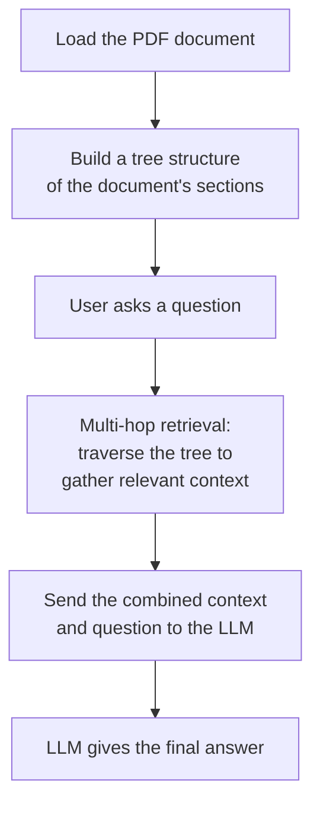
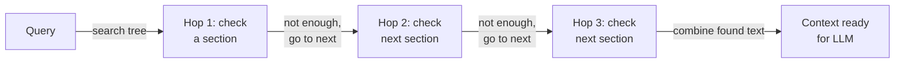

# Vectorless RAG — Multi-Hop Retrieval

## What is Multi-Hop Retrieval?

In a normal RAG (Retrieval-Augmented Generation) setup, a question is matched against chunks of text using vector embeddings, and the top matching chunks are handed to the LLM.

**Multi-hop retrieval** works differently. Instead of chunks and embeddings, the document is organized into a **tree** (sections, sub-sections, tables, text). When a question comes in, the search doesn't stop at the first match — it "hops" from one relevant part of the tree to the next, picking up context along the way, until it has gathered enough pieces to actually answer the question.

This is useful for questions that can't be answered from a single paragraph — for example, a question that needs a number from one section and a target from another section, to compare them.

## How We're Going to Implement It

The diagram below is the high-level picture of the whole notebook, from PDF to final answer.



---

## Walking Through the Notebook

### Setup

#### Install Dependencies
```python
!pip install pageindex langchain-openrouter requests
```
This installs the tree-based retrieval library, the LLM wrapper, and `requests` for handling files.

#### Import Libraries
```python
import os
import time
import requests

from pageindex import PageIndexClient
import pageindex.utils as utils
from dotenv import load_dotenv

from langchain_groq import ChatGroq
```
Brings in the retrieval client, a helper to load environment variables (like API keys), and the LLM wrapper we'll use later.

#### Setup API Keys
```python
load_dotenv("../.env")
PAGEINDEX_API_KEY = os.getenv("PAGEINDEX_API_KEY")
pi_client = PageIndexClient(api_key=PAGEINDEX_API_KEY)
```
Loads the API key from an `.env` file and creates the client we'll use to build and search the document tree.

---

### Load and Parse the PDF

#### Define PDF Path
```python
PDF_PATH = "data/CCS 3.31.25 Earnings Release 8-K Exhibit 99.1.pdf"

if os.path.exists(PDF_PATH):
    print(f"Success: Found the document at '{PDF_PATH}'")
else:
    print(f"Error: Could not find the document...")
```
A simple check to make sure the PDF is actually where the notebook expects it, before we try to do anything with it.

#### Submit and Index Document (Tree Construction)
```python
doc_info = pi_client.submit_document(PDF_PATH)
doc_id = doc_info["doc_id"]

while not pi_client.is_retrieval_ready(doc_id):
    time.sleep(5)
```
This is the step where the PDF is turned into a tree. The document is submitted, and the notebook waits (polling every 5 seconds) until the tree is fully built and ready to be searched.

#### Initialize the LLM
```python
llm = ChatGroq(
    model="...", 
    temperature=0.0,
    max_tokens=300  
)
```
Sets up the LLM that will later read the retrieved context and generate the final answer.

---

### Define Retrieval Function (Multi-Hop, With Explainability Tracking)

This is the core of the multi-hop logic — the function sends the question to the tree, waits for the search to finish, then walks through the top matching sections **one at a time**, pulling out text and logging each step as a "hop." This is what makes the retrieval explainable — you can see exactly which sections it visited and why.



```python
def retrieve_from_pageindex(query, doc_id, top_k=3):
    response = pi_client.submit_query(doc_id=doc_id, query=query)
    retrieval_id = response.get("retrieval_id")

    while True:
        retrieval = pi_client.get_retrieval(retrieval_id)
        status = retrieval.get("status")
        if status == "completed":
            break
        elif status == "failed":
            return [], []
        time.sleep(1)

    nodes = retrieval.get("retrieved_nodes", [])
    contexts = []
    trace_path = []

    for index, node in enumerate(nodes[:top_k]):
        node_name = node.get("node_title") or node.get("title") or f"Section {index + 1}"
        relevant_contents = node.get("relevant_contents", [])
        for group in relevant_contents:
            for item in group:
                content = item.get("relevant_content")
                if content:
                    contexts.append(content)
        preview = contexts[-1][:50].replace('\n', ' ') if contexts else "No text found"
        trace_path.append(f"Hop {index + 1}: {node_name} -> '{preview}...'")

    return contexts, trace_path
```

**What's happening here, step by step:**
1. The query is submitted to the document tree.
2. The notebook polls until the search is marked `completed`.
3. It loops through the top `top_k` matching sections **serially** (one after another) — this is the "hop."
4. For each hop, it pulls out the readable text and logs a short trace entry, so we can see the path it took to arrive at the answer.
5. It returns both the collected text (for the LLM) and the hop trail (for us, the humans).

#### Combine Context and Ask the LLM
```python
def vectorless_rag(query, doc_id):
    contexts, trace_path = retrieve_from_pageindex(query, doc_id)
    combined_context = "\n\n".join(contexts)

    prompt = f"""
You are a financial analyst. Answer the question using ONLY the data in the context below.
...
Context: {combined_context}
Question: {query}
"""
    response = llm.invoke(prompt)
    return response.content, trace_path
```
This ties it together — it calls the hop-by-hop retrieval function, combines everything it found into one block of context, and hands that context plus the question to the LLM with strict instructions to only use what's in the context.

---

### Run Query and Show the Tracking

#### Define the Question
```python
query = "Does the pace of home deliveries in Q1 2025 support the company's full-year 2025 guidance?"
```
This is a good test question for multi-hop retrieval because the answer likely needs numbers from more than one section (Q1 pace + full-year guidance).

#### Run and Print the Reasoning Trace
```python
final_answer, trace_path = vectorless_rag(query, doc_id)

print("--- SYSTEM REASONING TRACE ---")
for step in trace_path:
    print(step)
```
Runs the whole pipeline and prints out the hop trail — exactly which sections were visited, in order, to gather the context.

#### Print the Final Answer
```python
print(final_answer)
```
Prints the LLM's final answer, generated from the multi-hop context.