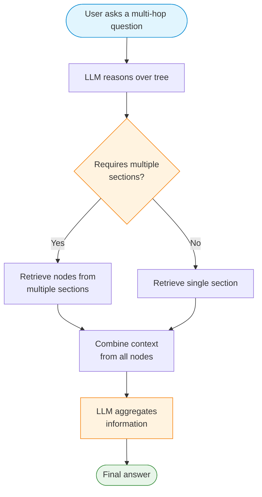
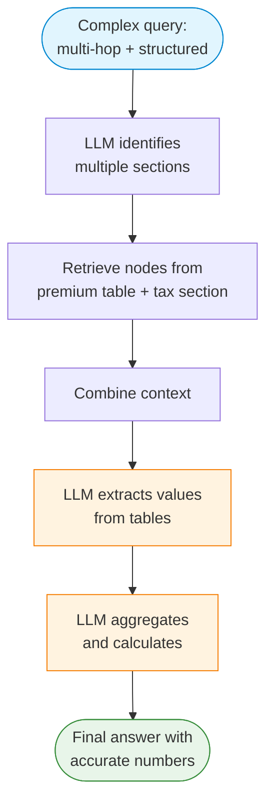
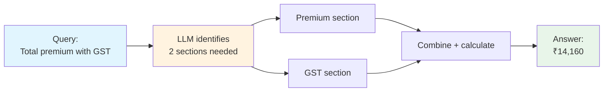
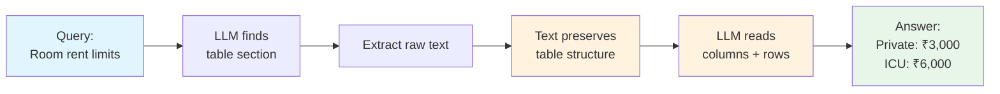

# 1. Lab Title

## Vectorless RAG: Multi-Hop Aggregation & Structured Data Fidelity

# What is Vectorless RAG?

**Vectorless RAG** replaces embeddings, vector stores, and text chunking with a single idea: let a Language Model (LLM) *reason over a document tree* and then *read the extracted text* from relevant pages.

This lab focuses on two advanced scenarios where Vectorless RAG excels:

1. **Multi-Hop Attribute Aggregation** — Questions that require combining information from multiple sections of a document.
2. **Structured Data Fidelity** — Extracting accurate values from tables, forms, and structured data.

# 2. Problem Statement / Use Case Overview

## Scenario 1: Multi-Hop Attribute Aggregation

**Problem:** Some questions cannot be answered from a single section. For example, "What is the total premium including GST?" requires finding:
- The base premium amount (Section A)
- The GST rate (Section B)
- Calculating the total

Traditional RAG retrieves chunks by similarity — it might find Section A OR Section B, but not both.

**Solution:** Vectorless RAG uses tree-based reasoning to identify that the answer requires **multiple sections**, then aggregates the information.

## Scenario 2: Structured Data Fidelity

**Problem:** Documents contain tables, forms, and structured data. Extracting this data accurately is critical — a wrong number can be costly.

**Solution:** The LLM reads the raw text (which preserves table structure) and extracts values with high fidelity, understanding column headers and row labels from context.

# 3. Input Data

| Item | Detail |
|------|--------|
| User query | Natural-language question about a PDF document |
| PDF document | Medicare Plus health insurance policy (`data/synthetic_medicare_plus_policy_detailed.pdf`) |
| PageIndex API Key | Used to parse the PDF into a hierarchical tree |
| OpenRouter API Key | Used to call the Language Model (Llama 4 Scout) |

# 4. Processing

## Multi-Hop Aggregation Flow



## Structured Data Fidelity Flow


## Combined Flow



1. The **PageIndex API** parses the PDF into a tree of sections and subsections.
2. The **LLM** reasons over the tree to identify which sections are needed.
3. For multi-hop queries, the LLM retrieves **multiple nodes** from different sections.
4. For structured data, the LLM reads the raw text and **extracts values accurately**.
5. The LLM **aggregates information** and provides a final answer.

# 5. Output

### Multi-Hop Example
> _"The total annual premium for 5 lakh sum insured is ₹12,000 (base) + ₹2,160 (18% GST) = ₹14,160."_

### Structured Data Example
> _"According to the table:\n- Private Hospital Room Rent: ₹3,000/day\n- ICU: ₹6,000/day"_

# 6. Tech Stack

| Layer | Technology |
|-------|------------|
| LLM | Llama 4 Scout via OpenRouter |
| Document Parsing | PageIndex API |
| PDF Text Extraction | PyMuPDF (`fitz`) |
| LLM Client | OpenAI SDK (compatible with OpenRouter) |
| Language | Python 3.12 |
| Runtime | Jupyter Notebook |

# 7. Underlying Concepts

## Multi-Hop Attribute Aggregation
- **Definition:** Combining information from multiple document sections to answer a single question.
- **Challenge:** Traditional RAG retrieves chunks by similarity — it may miss related sections.
- **Solution:** Tree-based reasoning allows the LLM to identify that the answer requires multiple sources.

## Structured Data Fidelity
- **Definition:** Extracting accurate values from tables, forms, and structured data.
- **Challenge:** PDF table extraction often loses formatting; wrong values can be costly.
- **Solution:** Raw text preserves table structure (column headers, row labels), allowing accurate extraction.

## Why Vectorless RAG Excels Here
- **No chunking** — the LLM reads complete sections, not arbitrary chunks.
- **Reasoning over similarity** — the LLM understands that a question requires multiple sources.
- **Text preservation** — raw text maintains table structure better than extracted data.

> Refer to the original implementation: [Clement-Okolo/Vectorless-Rag](https://github.com/Clement-Okolo/Vectorless-Rag)

# 8. Pre-requisites

- Basic familiarity with Python (functions, `import` statements).
- Completion of Lab 1 (Vectorless RAG basics).
- **PageIndex API Key** — sign up at [pageindex.ai](https://pageindex.ai).
- **OpenRouter API Key** — sign up at [openrouter.ai](https://openrouter.ai).
- Understanding of what multi-hop reasoning means in the context of RAG.

# 9. Environment / Dependencies Setup

The cell below installs all required Python packages:

| Package | Purpose |
|---------|---------|
| `pageindex` | Document tree generation and retrieval via PageIndex API |
| `openai` | LLM client (used with OpenRouter's OpenAI-compatible endpoint) |
| `python-dotenv` | Load API keys from `.env` file |
| `pymupdf` | Extract text from PDF pages |

Run this cell first — it only needs to be run once per session.

```python
!pip install -q pageindex openai python-dotenv pymupdf
```

### Load API Keys

Your API keys are stored in the `.env` file in the project root. The cell below loads them.

```python
import os
import json
import re
import fitz  # PyMuPDF
from openai import OpenAI
from dotenv import load_dotenv

load_dotenv("../.env")

PAGEINDEX_API_KEY = os.getenv("PAGEINDEX_API_KEY")
OPENROUTER_API_KEY = os.getenv("OPENROUTER_API_KEY")

print("Keys loaded.")
```

### Set up the LLM

```python
def call_llm(prompt, model="meta-llama/llama-4-scout-17b-16e-instruct"):
    """Call a language model via OpenRouter."""
    client = OpenAI(
        base_url="https://openrouter.ai/api/v1",
        api_key=OPENROUTER_API_KEY,
    )
    msgs = [{"role": "user", "content": prompt}]
    resp = client.chat.completions.create(model=model, messages=msgs, temperature=0, max_tokens=1024)
    return resp.choices[0].message.content.strip()
```

---

## Helper Functions

These functions handle text extraction, node retrieval, and context building.

```python
def extract_page_text(pdf_path):
    """Extract text from each PDF page."""
    doc = fitz.open(pdf_path)
    texts = {}
    for i in range(len(doc)):
        texts[i+1] = doc.load_page(i).get_text()
    doc.close()
    return texts
```

```python
def retrieve_nodes(query, tree):
    """Use LLM to find relevant nodes for a query."""
    tree_slim = utils.remove_fields(tree.copy(), fields=["text"])
    search_prompt = f"""
You are given a question and a document tree.
Each node has: node_id, title, summary.
Find all nodes likely to contain the answer.

Question: {query}

Document tree:
{json.dumps(tree_slim, indent=2)}

Reply in this JSON format ONLY:
{{
    "thinking": "<your reasoning>",
    "node_list": ["node_id_1", "node_id_2"]
}}
"""
    raw = call_llm(search_prompt)
    result = parse_json(raw)
    return result["thinking"], result["node_list"]
```

```python
def get_context(node_list, tree, page_texts):
    """Extract text from pages covered by the given nodes."""
    node_map = utils.create_node_mapping(tree, include_page_ranges=True, max_page=len(page_texts))
    texts, seen = [], set()
    for nid in node_list:
        info = node_map[nid]
        for p in range(info["start_index"], info["end_index"] + 1):
            if p not in seen and p in page_texts:
                texts.append(f"--- Page {p} ---\n{page_texts[p]}")
                seen.add(p)
    return "\n\n".join(texts)
```

---

# Scenario 1: Multi-Hop Attribute Aggregation



### Example Query

```python
QUERY_MULTI_HOP = "What is the total annual premium including 18% GST for a sum insured of 5 lakhs?"
```

### Retrieve and Answer

```python
thinking, nodes = retrieve_nodes(QUERY_MULTI_HOP, tree)
print("Reasoning:", thinking)
print("Nodes:", nodes)

context = get_context(nodes, tree, page_texts)
answer = answer_query(QUERY_MULTI_HOP, context)
print("Answer:", answer)
```

### Why Multi-Hop is Hard

Traditional RAG retrieves chunks by similarity. A query about "total premium with GST" might only match the premium section OR the GST section — not both. Vectorless RAG with tree-based reasoning can identify that the answer requires **multiple sections**.

---

# Scenario 2: Structured Data Fidelity



### Example Query

```python
QUERY_STRUCTURED = "What are the room rent limits for Private Hospital and ICU according to the table?"
```

### Retrieve and Answer

```python
thinking, nodes = retrieve_nodes(QUERY_STRUCTURED, tree)
print("Reasoning:", thinking)
print("Nodes:", nodes)

context = get_context(nodes, tree, page_texts)
answer = answer_query(QUERY_STRUCTURED, context)
print("Answer:", answer)
```

### Why Structured Data Fidelity Matters

Tables in PDFs are often poorly formatted when extracted. Vectorless RAG preserves the original text flow, allowing the LLM to understand table structure from context (column headers, row labels, etc.).

---

# Scenario 3: Combined — Multi-Hop + Structured Data


### Example Query

```python
QUERY_COMBINED = "Based on the premium table, what is the total premium for a 25-year-old with 5 lakh sum insured including all taxes?"
```

### Retrieve and Answer

```python
thinking, nodes = retrieve_nodes(QUERY_COMBINED, tree)
print("Reasoning:", thinking)
print("Nodes:", nodes)

context = get_context(nodes, tree, page_texts)
answer = answer_query(QUERY_COMBINED, context)
print("Answer:", answer)
```

---

## Try It Yourself

Change the `QUERY_*` variables and re-run the cells.

| Scenario | Example Question |
|----------|------------------|
| Multi-Hop | "What is the waiting period for PED and how does it reduce over years?" |
| Structured Data | "List all the day care procedures covered with their limits." |
| Combined | "Calculate the total deductible for a claim of 5 lakhs including all sub-limits." |
