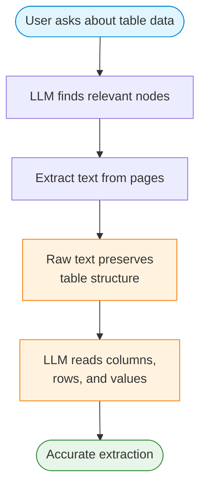
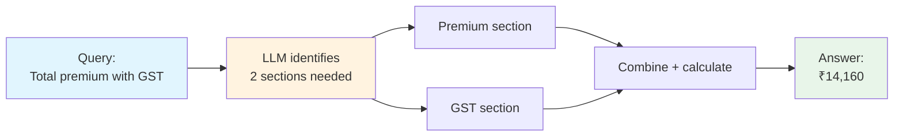
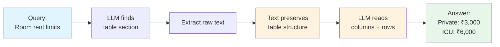
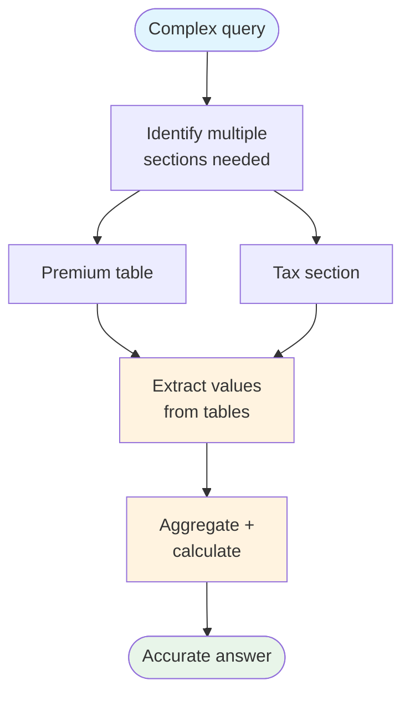

# 1. Lab Title

## Vectorless RAG: Multi-Hop Aggregation & Structured Data Fidelity

# What is Vectorless RAG?

**Vectorless RAG** replaces embeddings, vector stores, and text chunking with a single idea: let a Language Model (LLM) *reason over a document tree* and then *read the extracted text* from relevant pages.

This lab focuses on two advanced scenarios where Vectorless RAG excels:

1. **Multi-Hop Attribute Aggregation** — Questions that require combining information from multiple sections of a document.
2. **Structured Data Fidelity** — Extracting accurate values from tables, forms, and structured data.

# 2. Problem Statement / Use Case Overview

## Scenario 1: Multi-Hop Attribute Aggregation

**Problem:** Some questions cannot be answered from a single section. For example, "What is the total premium including GST?" requires finding:
- The base premium amount (Section A)
- The GST rate (Section B)
- Calculating the total

Traditional RAG retrieves chunks by similarity — it might find Section A OR Section B, but not both.

**Solution:** Vectorless RAG uses tree-based reasoning to identify that the answer requires **multiple sections**, then aggregates the information.

## Scenario 2: Structured Data Fidelity

**Problem:** Documents contain tables, forms, and structured data. Extracting this data accurately is critical — a wrong number can be costly.

**Solution:** The LLM reads the raw text (which preserves table structure) and extracts values with high fidelity, understanding column headers and row labels from context.

# 3. Input Data

| Item | Detail |
|------|--------|
| User query | Natural-language question about a PDF document |
| PDF document | Medicare Plus health insurance policy (`data/synthetic_medicare_plus_policy_detailed.pdf`) |
| PageIndex API Key | Used to parse the PDF into a hierarchical tree |
| OpenRouter API Key | Used to call the Language Model (Llama 4 Scout) |

# 4. Processing

## Multi-Hop Aggregation Flow


## Structured Data Fidelity Flow



## Combined Flow


1. The **PageIndex API** parses the PDF into a tree of sections and subsections.
2. The **LLM** reasons over the tree to identify which sections are needed.
3. For multi-hop queries, the LLM retrieves **multiple nodes** from different sections.
4. For structured data, the LLM reads the raw text and **extracts values accurately**.
5. The LLM **aggregates information** and provides a final answer.

# 5. Output

### Multi-Hop Example
> _"The total annual premium for 5 lakh sum insured is ₹12,000 (base) + ₹2,160 (18% GST) = ₹14,160."_

### Structured Data Example
> _"According to the table:\n- Private Hospital Room Rent: ₹3,000/day\n- ICU: ₹6,000/day"_

# 6. Tech Stack

| Layer | Technology |
|-------|------------|
| LLM | Llama 4 Scout via OpenRouter |
| Document Parsing | PageIndex API |
| PDF Text Extraction | PyMuPDF (`fitz`) |
| LLM Client | OpenAI SDK (compatible with OpenRouter) |
| Language | Python 3.12 |
| Runtime | Jupyter Notebook |

# 7. Underlying Concepts

## Multi-Hop Attribute Aggregation
- **Definition:** Combining information from multiple document sections to answer a single question.
- **Challenge:** Traditional RAG retrieves chunks by similarity — it may miss related sections.
- **Solution:** Tree-based reasoning allows the LLM to identify that the answer requires multiple sources.

## Structured Data Fidelity
- **Definition:** Extracting accurate values from tables, forms, and structured data.
- **Challenge:** PDF table extraction often loses formatting; wrong values can be costly.
- **Solution:** Raw text preserves table structure (column headers, row labels), allowing accurate extraction.

## Why Vectorless RAG Excels Here
- **No chunking** — the LLM reads complete sections, not arbitrary chunks.
- **Reasoning over similarity** — the LLM understands that a question requires multiple sources.
- **Text preservation** — raw text maintains table structure better than extracted data.

> Refer to the original implementation: [Clement-Okolo/Vectorless-Rag](https://github.com/Clement-Okolo/Vectorless-Rag)

# 8. Pre-requisites

- Basic familiarity with Python (functions, `import` statements).
- Completion of Lab 1 (Vectorless RAG basics).
- **PageIndex API Key** — sign up at [pageindex.ai](https://pageindex.ai).
- **OpenRouter API Key** — sign up at [openrouter.ai](https://openrouter.ai).
- Understanding of what multi-hop reasoning means in the context of RAG.

# 9. Environment / Dependencies Setup

## Install Dependencies

The cell below installs all required Python packages:

| Package | Purpose |
|---------|---------|
| `pageindex` | Document tree generation and retrieval via PageIndex API |
| `openai` | LLM client (used with OpenRouter's OpenAI-compatible endpoint) |
| `python-dotenv` | Load API keys from `.env` file |
| `pymupdf` | Extract text from PDF pages |

Run this cell first — it only needs to be run once per session.

```python
!pip install -q pageindex openai python-dotenv pymupdf
```

## Import Libraries

Import the standard library and third-party modules used throughout the notebook. `os` and `json` handle file paths and caching. `re` parses JSON from LLM responses. `fitz` (PyMuPDF) extracts text from PDFs. `OpenAI` is the LLM client. `load_dotenv` loads API keys from the `.env` file.

```python
import os
import json
import re
import fitz
from openai import OpenAI
from dotenv import load_dotenv
```

## Load API Keys

Load API keys from the `.env` file in the project root (`../.env` relative to this notebook). If either key is missing from `.env`, you'll be prompted to enter it manually.

```python
load_dotenv("../.env")

PAGEINDEX_API_KEY = os.getenv("PAGEINDEX_API_KEY")
OPENROUTER_API_KEY = os.getenv("OPENROUTER_API_KEY")

# If keys are missing, prompt the user to enter them
if not PAGEINDEX_API_KEY:
    PAGEINDEX_API_KEY = input("Enter your PageIndex API key (get one at https://pageindex.ai): ").strip()
if not OPENROUTER_API_KEY:
    OPENROUTER_API_KEY = input("Enter your OpenRouter API key (get one at https://openrouter.ai): ").strip()

print("Keys loaded.")
```

## Set Up the LLM

### `call_llm(prompt, model)`

Sends a prompt to the LLM via OpenRouter and returns the response text. Creates a fresh OpenAI client pointed at OpenRouter's API endpoint. Uses `meta-llama/llama-4-scout-17b-16e-instruct` by default with `temperature=0` for deterministic output.

```python
def call_llm(prompt, model="meta-llama/llama-4-scout-17b-16e-instruct"):
    """Call a language model via OpenRouter."""
    client = OpenAI(
        base_url="https://openrouter.ai/api/v1",
        api_key=OPENROUTER_API_KEY,
    )
    msgs = [{"role": "user", "content": prompt}]
    resp = client.chat.completions.create(model=model, messages=msgs, temperature=0, max_tokens=1024)
    return resp.choices[0].message.content.strip()
```

---

## Load and Parse the PDF

Extract text from each page of the PDF using PyMuPDF. This text will be used as context for the LLM when answering questions.

### Define PDF Path

Point this to any PDF you want to query.

```python
PDF_PATH = "data/your_document.pdf"
```

### Extract Text from PDF

Opens the PDF with PyMuPDF and builds a dictionary mapping 1-based page numbers to their extracted text. The raw text preserves table structure (column headers, row labels) which is critical for accurate data extraction.

```python
doc = fitz.open(PDF_PATH)
page_texts = {i+1: doc.load_page(i).get_text() for i in range(len(doc))}
doc.close()
print(f"Extracted text from {len(page_texts)} pages.")
```

---

## Build Document Tree (with caching)

The PageIndex API parses the PDF into a hierarchical tree of sections and subsections. The tree is cached as JSON so repeat runs with the same PDF skip the API call.

### Set Up Caching and PageIndex

Import the PageIndex client and define the cache path. The cache file is named after the PDF filename with `_tree.json` appended.

```python
from pageindex import PageIndexClient
from pageindex import utils
import time

CACHE_PATH = f"cache/{os.path.basename(PDF_PATH).replace('.pdf', '_tree.json')}"
os.makedirs("cache", exist_ok=True)
```

### Load or Build the Tree

Try loading from cache first. If it's a cache miss, submit the PDF to PageIndex, poll until processing completes (up to 5 minutes), save the result to cache, and display the tree structure.

```python
tree = None
if os.path.exists(CACHE_PATH):
    with open(CACHE_PATH) as f:
        tree = json.load(f)
    print("Loaded tree from cache.")

if tree is None:
    pi = PageIndexClient(api_key=PAGEINDEX_API_KEY)
    result = pi.submit_document(PDF_PATH)
    doc_id = result["doc_id"]
    print(f"Submitted: {doc_id}")

    elapsed = 0
    while elapsed < 300:
        if pi.is_retrieval_ready(doc_id):
            break
        time.sleep(5)
        elapsed += 5
        print(f"  {elapsed}s...")
    else:
        raise TimeoutError("PageIndex timeout")

    tree = pi.get_tree(doc_id, node_summary=True)["result"]
    with open(CACHE_PATH, "w") as f:
        json.dump(tree, f, indent=2)
    print("Tree cached.")

utils.print_tree(tree, exclude_fields=["text"])
```

---

## Helper Functions

Reusable functions for retrieving nodes and building context from the document tree.

### `parse_json(text)`

Extracts a JSON object from the LLM's response text. Handles markdown code fences (```` ```json ... ``` ````) that LLMs often wrap around JSON output, then parses the inner JSON.

```python
def parse_json(text):
    """Extract JSON from LLM response."""
    text = re.sub(r"```json\s*|\s*```", "", text.strip())
    s, e = text.find("{"), text.rfind("}")
    if s != -1 and e != -1:
        text = text[s:e+1]
    return json.loads(text)
```

### `retrieve_nodes(query)`

Uses the LLM to find relevant nodes for a given query. Strips full text from the tree (keeping only titles + summaries), sends it to the LLM with the question, and returns the parsed JSON result containing the LLM's reasoning and a list of relevant node IDs. This is the core retrieval function that enables tree-based reasoning.

```python
def retrieve_nodes(query):
    """Use LLM to find relevant nodes for a query."""
    tree_slim = utils.remove_fields(tree.copy(), fields=["text"])
    prompt = f"""
Given a question and a document tree (node_id, title, summary),
find nodes likely to contain the answer.

Question: {query}

Tree:
{json.dumps(tree_slim, indent=2)}

JSON only:
{{"thinking": "...", "node_list": ["id1", "id2"]}}
"""
    return parse_json(call_llm(prompt))
```

### `get_context(node_list)`

Extracts text from pages covered by the given node list. Maps each node ID to its page range, collects the extracted text from those pages (deduplicating), and joins them with page separators. Returns a single string of all relevant page text.

```python
def get_context(node_list):
    """Extract text from pages covered by the given nodes."""
    node_map = utils.create_node_mapping(tree, include_page_ranges=True, max_page=len(page_texts))
    texts, seen = [], set()
    for nid in node_list:
        info = node_map[nid]
        for p in range(info["start_index"], info["end_index"] + 1):
            if p not in seen and p in page_texts:
                texts.append(f"--- Page {p} ---\n{page_texts[p]}")
                seen.add(p)
    return "\n\n".join(texts)
```

---

# Scenario 1: Multi-Hop Attribute Aggregation



### Define Multi-Hop Query

Set a question that requires information from multiple document sections to answer.

```python
QUERY_MULTI_HOP = "What is the total annual premium including 18% GST for a sum insured of 5 lakhs?"
```

### Retrieve Nodes for Multi-Hop Query

Send the query to the LLM to identify which nodes are relevant. For multi-hop questions, the LLM should return nodes from multiple sections.

```python
result = retrieve_nodes(QUERY_MULTI_HOP)
print("Reasoning:", result["thinking"], "\n")
print("Retrieved nodes:", result["node_list"])
```

### Answer Multi-Hop Query

Build context from the retrieved nodes and send it to the LLM with the question to get the final answer.

```python
context = get_context(result["node_list"])
answer = call_llm(f"Context:\n{context}\n\nQuestion: {QUERY_MULTI_HOP}\n\nAnswer concisely.")
print("Answer:", answer)
```

### Why Multi-Hop is Hard

Traditional RAG retrieves chunks by similarity. A query about "total premium with GST" might only match the premium section OR the GST section — not both. Vectorless RAG with tree-based reasoning can identify that the answer requires **multiple sections**.

---

# Scenario 2: Structured Data Fidelity



### Define Structured Data Query

Set a question about extracting specific values from a table in the document.

```python
QUERY_STRUCTURED = "What are the room rent limits for Private Hospital and ICU according to the table?"
```

### Retrieve Nodes for Structured Data

Find the nodes containing the relevant table or structured data.

```python
result = retrieve_nodes(QUERY_STRUCTURED)
print("Reasoning:", result["thinking"], "\n")
print("Retrieved nodes:", result["node_list"])
```

### Answer Structured Data Query

Extract the page text from the retrieved nodes and have the LLM read the raw table data to produce an accurate answer.

```python
context = get_context(result["node_list"])
answer = call_llm(f"Context:\n{context}\n\nQuestion: {QUERY_STRUCTURED}\n\nAnswer concisely.")
print("Answer:", answer)
```

### Why Structured Data Fidelity Matters

Tables in PDFs are often poorly formatted when extracted. Vectorless RAG preserves the original text flow, allowing the LLM to understand table structure from context (column headers, row labels, etc.).

---

# Scenario 3: Combined — Multi-Hop + Structured Data



### Define Combined Query

Set a question that needs both multi-hop reasoning across sections and accurate table extraction.

```python
QUERY_COMBINED = "Based on the premium table, what is the total premium for a 25-year-old with 5 lakh sum insured including all taxes?"
```

### Retrieve Nodes for Combined Query

Find nodes from multiple sections that contain both the table data and the related calculations.

```python
result = retrieve_nodes(QUERY_COMBINED)
print("Reasoning:", result["thinking"], "\n")
print("Retrieved nodes:", result["node_list"])
```

### Answer Combined Query

Build context from all relevant nodes and have the LLM aggregate information from tables while performing multi-hop reasoning.

```python
context = get_context(result["node_list"])
answer = call_llm(f"Context:\n{context}\n\nQuestion: {QUERY_COMBINED}\n\nAnswer concisely.")
print("Answer:", answer)
```

---

## Try It Yourself

Change the `QUERY_*` variables and re-run the cells.

| Scenario | Example Question |
|----------|------------------|
| Multi-Hop | "What is the waiting period for PED and how does it reduce over years?" |
| Structured Data | "List all the day care procedures covered with their limits." |
| Combined | "Calculate the total deductible for a claim of 5 lakhs including all sub-limits." |
