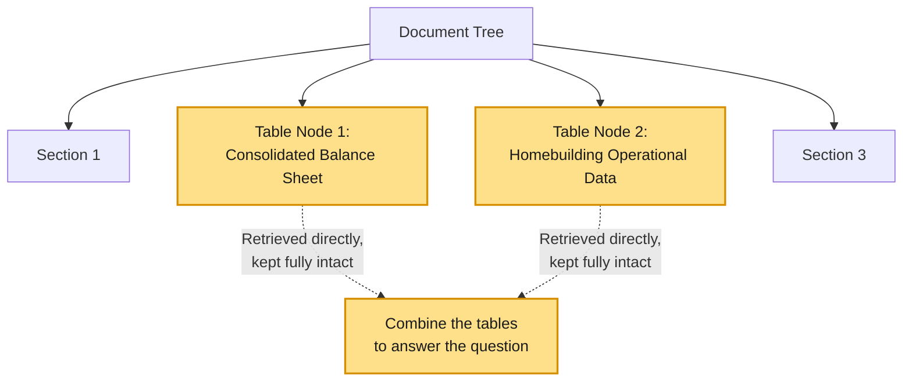
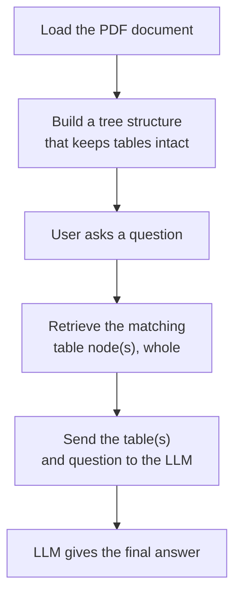
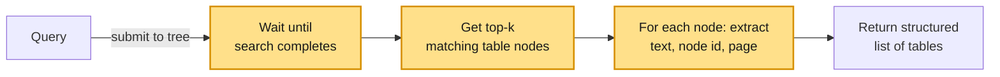

# Vectorless RAG — Structured Table Retrieval

## What is Table-Safe Retrieval?

Standard AI systems process PDF documents by chopping the text into fixed-size chunks based on word limits. When a document contains a financial table, this chopping process often cuts right through the middle of it, separating the numbers from their column headers. When the data is broken apart like this, the AI loses the context and is forced to guess, which leads to incorrect answers.

Table-Safe Retrieval solves this by looking at the actual layout of the page instead of just counting words. It identifies every table and saves it as one complete, unbroken piece (a "node"). When you ask a question about financial data, the system pulls up the entire table at once. Because the AI can see the headers, rows, and footnotes all together, it can give you a perfectly accurate answer without guessing. 

Here's how that looks visually:



Notice both highlighted table nodes connect **straight down** from the root, not through each other — that's the key difference from multi-hop. There's no "check this section, then go deeper, then jump sideways." Each relevant table is found independently in a single step, kept fully intact, and only combined at the very end when it's time to build the answer.

## How We're Going to Implement It



---

## Walking Through the Notebook

### Install Required Libraries
```python
!pip install pageindex langchain-groq
```
Installs the tree-based retrieval library and the LLM wrapper.

### Import Libraries
```python
import os
import time
import re

from pageindex import PageIndexClient
from dotenv import load_dotenv
import pageindex.utils as utils

from langchain_groq import ChatGroq
```
Brings in the retrieval client, a helper to load API keys from a `.env` file, a small utility for printing the tree, and the LLM wrapper.

### Setup API Keys
```python
load_dotenv("../.env")
PAGEINDEX_API_KEY = os.getenv("PAGEINDEX_API_KEY")
pi_client = PageIndexClient(api_key=PAGEINDEX_API_KEY)
```
Loads the API key and creates the client used to build and search the document tree.

---

### Locate the Financial Document
```python
PDF_PATH = "data/CCS 3.31.25 Earnings Release 8-K Exhibit 99.1.pdf"

if os.path.exists(PDF_PATH):
    print(f"Success: Found the financial document at '{PDF_PATH}'")
else:
    print(f"Error: Could not find the document. Check your folder structure!")
```
A simple check to make sure the PDF is where the notebook expects it, before doing anything with it.

### Index the Document (Preserving Tables)
```python
doc_info = pi_client.submit_document(PDF_PATH)
doc_id = doc_info["doc_id"]

while not pi_client.is_retrieval_ready(doc_id):
    time.sleep(5)
```
The document is submitted to PageIndex, which maps it into a logical tree — critically, tables are kept together as whole nodes instead of being chopped up by a fixed chunk size. The notebook polls every 5 seconds until this is done.

### Print the Document Tree
```python
tree = pi_client.get_tree(doc_id, node_summary=True)["result"]
print("Document Tree Structure:")
utils.print_tree(tree)
```
Prints the tree PageIndex built from the PDF, so you can see every section and table as a node, each with a short summary. Good for confirming the tables (Balance Sheet, Operational Data, Non-GAAP Reconciliation, etc.) each came through as their own clean node before running any queries.

### Initialize the LLM
```python
llm = ChatGroq(
    model="llama-3.1-8b-instant",
    temperature=0.1
)
```
Sets up the LLM that will read the retrieved table(s) and answer the question. Temperature is kept low (0.1) so it doesn't get "creative" with financial numbers.

---

### Define Table-Safe Retrieval Function (Tagged for Explainability)

This function sends the question to the tree and pulls back the top matching table node(s), whole. For each one, it records the table title, the node's unique ID, and the page number(s) — the same explainability metadata used in the multi-hop lab, just applied to tables instead of hops.

Here's how the function actually executes, step by step:



```python
def retrieve_from_pageindex(query, doc_id, top_k=2):
    response = pi_client.submit_query(doc_id=doc_id, query=query)
    retrieval_id = response.get("retrieval_id")

    if not retrieval_id:
        return []

    while True:
        retrieval = pi_client.get_retrieval(retrieval_id)
        status = retrieval.get("status")
        if status == "completed":
            break
        elif status == "failed":
            return []
        time.sleep(1)

    nodes = retrieval.get("retrieved_nodes", [])
    tables = []

    for index, node in enumerate(nodes[:top_k]):
        node_name = node.get("title") or f"Table {index + 1}"
        node_id = node.get("id", "unknown")  # PageIndex returns the node's ID under "id"
        relevant_contents = node.get("relevant_contents", [])

        section_text = []
        page_numbers = []
        for group in relevant_contents:
            for item in group:
                content = item.get("relevant_content")
                if content:
                    section_text.append(content)

                # page number is embedded in a string like "<physical_index_6>"
                raw_page = item.get("physical_index", "")
                match = re.search(r"(\d+)", raw_page) if isinstance(raw_page, str) else None
                if match:
                    page_num = int(match.group(1))
                    if page_num not in page_numbers:
                        page_numbers.append(page_num)

        tables.append({
            "table_number": index + 1,
            "section": node_name,
            "node_id": node_id,
            "pages": page_numbers,
            "text": "\n".join(section_text)
        })

    return tables
```

**What's happening here, step by step:**
1. The query is submitted to the document tree.
2. The notebook polls until the search is marked `completed`.
3. It loops through the top `top_k` matching table nodes.
4. For each one, it pulls out the full table text, the node's ID, and its page number(s) (using a small regex, since PageIndex embeds the page inside a string like `"<physical_index_6>"` rather than as a plain number).
5. It returns a structured list of tables — each one knowing exactly which section, node, and page it came from.

### Build Vectorless RAG Pipeline (With Table Citations)
```python
def vectorless_rag(query, doc_id):
    tables = retrieve_from_pageindex(query, doc_id)

    if not tables:
        return "No relevant context found.", [], ""

    labeled_context = "\n\n".join(
        f"[Table {t['table_number']} - {t['section']}]\n{t['text']}" for t in tables
    )

    prompt = f"""
You are a financial data analyst. Answer the question ONLY using the provided text/tables below.
Pay strict attention to table rows, columns, and footnotes. Do not round numbers unless asked.

CRITICAL INSTRUCTIONS:
- Every number you use MUST be tagged with its table, like this: [Table 1]
- If you use numbers from more than one table, tag each one separately.
- If the data is not in the text, say "Not found in document."

Context:
{labeled_context}

Question: {query}
"""

    response = llm.invoke(prompt)
    final_answer = response.content

    return final_answer, tables, labeled_context
```
This ties it together — it calls the retrieval function, labels each table clearly in the context (e.g. `[Table 1 - Consolidated Balance Sheets]`), and instructs the LLM to tag every number it uses with the table it came from. That citation is what later lets us check which retrieved tables the LLM actually relied on.

---

### Query a Specific Table Metric

#### Define the Question
```python
query = "What was the total revenue for the three months ended March 31, 2025?"
```
A good test question because the answer lives in exactly one table (Consolidated Statements of Operations) — a clean, single-table lookup.

#### Run the Pipeline and Print the Trace + Answer
```python
final_answer, tables, labeled_context = vectorless_rag(query, doc_id)

print("--- TABLES SEARCHED ---")
for t in tables:
    print(f"Table {t['table_number']}: {t['section']}")

print("\n--- FINAL ANSWER ---")
print(final_answer)
```
Runs the pipeline, prints which tables were searched, prints the final answer, and checks the answer text for `[Table N]` citations — a lightweight way to know which retrieved tables actually made it into the answer, with no extra LLM call needed.

#### Print the Explainability Report
```python
print("\n--- EXPLAINABILITY ---")
for t in tables:
    pages = ", ".join(str(p) for p in t["pages"]) if t["pages"] else "unknown"
    was_used = t["table_number"]
    status = "USED in answer" if was_used else "retrieved but NOT used"

    print(f"\nTable {t['table_number']}: \"{t['section']}\"")
    print(f"node_id: {t['node_id']} | page(s): {pages} | {status}")

    explain_prompt = f"""
In 3-4 short lines, explain why the table below is relevant to the question.
Be specific -- mention the actual numbers or rows in the table that connect to the question.
Do not repeat the question. Do not add extra commentary.

Question: {query}

Table title: {t['section']}
Table content: {t['text']}
"""
    explanation_response = llm.invoke(explain_prompt)
    print(f"Why: {explanation_response.content.strip()}")
```
The final layer of explainability. For every table, it prints:
- **Where** it came from — table title, node ID, and page number(s)
- **Whether** it was actually used in the final answer (via the citation check above)
- **Why** it's relevant — a short explanation generated by asking the LLM to justify the table against the question, grounded in the real retrieved rows (PageIndex doesn't expose an internal relevance score, so this is the most honest "why" available from real data).