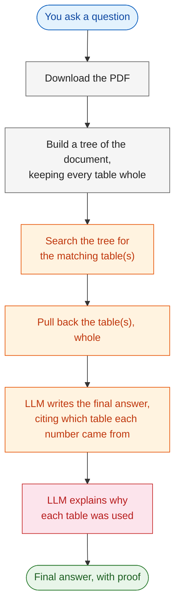
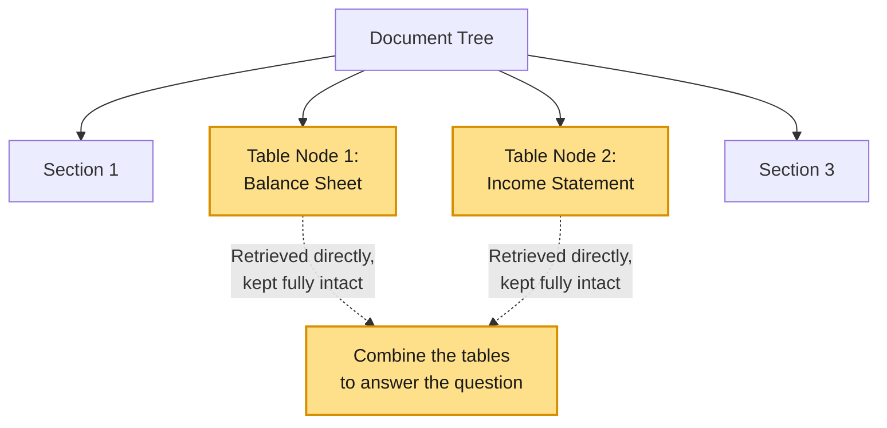
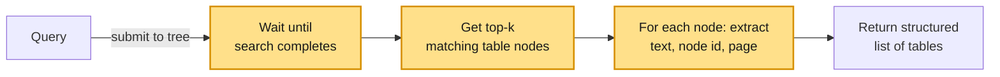

# Vectorless RAG: Structured Table Retrieval with Explainability Tracking

---

# Problem Statement / Use Case Overview

Most AI systems break a document into fixed-size pieces of text, just by word count. When a document has a financial table, this often cuts right through the middle of it — separating the numbers from their column headers. Once a table is split apart like that, the AI loses the context and starts guessing, which leads to wrong answers.

This lab avoids that problem entirely. It looks at the actual layout of the page instead of counting words, so every table is kept as one whole, unbroken piece. When you ask a question about financial data, the whole table comes back together — headers, rows, and footnotes all in one place — so the answer doesn't need any guesswork.

On top of that, every answer comes with proof: for each table used, the lab shows where it came from, whether it was actually used, and why it's relevant.

This is especially useful for:
- **Financial statements** — balance sheets, income statements, reconciliation tables
- **Any report where a single row-and-column lookup needs to be exact**
- **Questions where the numbers must be traceable back to a specific table**

---

# Input Data

| Item | Detail |
|------|--------|
| **Your question** | A question that points to a specific number inside a financial table |
| **The PDF** | A company's earnings release, downloaded automatically from a link — no need to have it saved beforehand |
| **PageIndex API Key** | Used to read the PDF and turn it into a tree, keeping every table whole, and to search that tree |
| **AWS Bedrock Credentials** | Used to connect to the LLM that reads the table(s) and writes the answer |

---

# Processing

### The Full Flow



### How Tables Are Kept Whole



Notice both highlighted table nodes connect **straight down** from the root, not through each other. Each relevant table is found on its own, in a single step, kept fully intact, and only combined at the very end when it's time to build the answer. There's no back-and-forth checking between sections — each table is either the answer, or it isn't.

### Pulling Back a Table, Step by Step



---

# Output

A plain, accurate answer built directly from the numbers in the relevant table(s), with every figure tagged to the table it came from. For example:

> _"The figure you asked about was found directly in the table — for example, $XXX million. [Table 1]"_

Along with the answer, the lab also prints:
- **A list of the tables it checked**, in the order they were found
- **A short explanation for each table** — its title, page number, whether it was actually cited in the answer, and why it mattered

---

# Tech Stack

| Component | Tool |
|---|---|
| **Reading the document** | PageIndex — turns the PDF into a tree, keeping every table as one whole piece |
| **Searching for tables** | PageIndex's search — pulls back the top matching table(s) directly, no embeddings needed |
| **Writing the answer** | Amazon Nova Lite, through AWS Bedrock — reads the table(s), writes the answer, and tags every number with its source table |
| **Connecting to the LLM** | LangChain (`langchain-aws`) — `ChatBedrockConverse` wraps the Bedrock Converse API |
| **Downloading the PDF** | `requests` — grabs the file from a link and saves it locally |

---

# Underlying Concepts (Summarized)

Regular AI systems chop documents into fixed-size pieces by word count, which is a problem for financial tables — the cut can land right between the numbers and their headers, and the AI ends up guessing at what a number actually means.

This lab avoids that by reading the layout of the page instead of just counting words. Every table is saved as one complete node, so nothing gets separated from its headers, rows, or footnotes.

There's also a difference in *how* the answer is checked here compared to a step-by-step, section-hopping search. In a multi-hop setup, the search checks several sections one after another, hopping from one to the next. Here, each table is found on its own, independently, and kept whole — there's no hopping between them, just a direct match followed by combining whatever tables were found.

To make the answer trustworthy, the LLM is instructed to tag every number it uses with the table it came from, like `[Table 1]`. That tag is what lets the lab check — with no extra guessing — which tables actually made it into the final answer.

---

# Pre-requisites

- A PageIndex API key
- AWS Bedrock credentials (Access Key, Secret Key, Endpoint URL, Region)
- A basic idea of what an LLM is

---

# Environment / Dependencies Setup

The cell below installs all required Python packages:

| Package | Purpose |
|---------|---------|
| `pageindex` | Reads the PDF, builds the tree, and keeps tables whole while searching |
| `langchain-aws` | Connects to the LLM through AWS Bedrock |
| `boto3` | Handles the AWS connection behind the scenes |
| `requests` | Downloads the PDF from a link |

```python
# Install the required libraries
!pip install pageindex langchain-aws boto3 requests
```

## Import Libraries

```python
# Core modules
import os
import time
import re
import requests

# PageIndex client for vectorless retrieval
from pageindex import PageIndexClient
import pageindex.utils as utils

# LangChain's AWS Bedrock wrapper
from langchain_aws import ChatBedrockConverse

# --- ALTERNATIVE: If using Azure OpenAI instead of AWS Bedrock, uncomment the line below ---
# from langchain_openai import AzureChatOpenAI
```

## Add Your Keys

```python
# --- Configure AWS Bedrock credentials ---
os.environ["AWS_ACCESS_KEY_ID"]     = "YOUR_ACCESS_KEY_ID"
os.environ["AWS_SECRET_ACCESS_KEY"] = "YOUR_SECRET_ACCESS_KEY"
os.environ["AWS_ENDPOINT_URL"]      = "https://api.enterprisesi.co/api/v1/aws-genai/bedrock-runtime"
os.environ["AWS_REGION"]            = "ap-south-1"

print("Credentials configured.")

# --- ALTERNATIVE: If using Azure OpenAI instead of AWS Bedrock, comment out the AWS block
# above and uncomment the two lines below (only the API key and endpoint are needed) ---
# os.environ["AZURE_OPENAI_API_KEY"]  = "YOUR_AZURE_OPENAI_API_KEY"
# os.environ["AZURE_OPENAI_ENDPOINT"] = "YOUR_AZURE_OPENAI_ENDPOINT"

# --- Load PageIndex API Key ---
PAGEINDEX_API_KEY = input("Enter your PageIndex API key (get one at https://pageindex.ai): ").strip()
os.environ["PAGEINDEX_API_KEY"] = PAGEINDEX_API_KEY

print("PageIndex key loaded.")

# Initialize the PageIndex Client
pi_client = PageIndexClient(api_key=PAGEINDEX_API_KEY)
```

> 📝 **Note:** You'll find your keys under the key icon on the top right of the platform. Copy the API Key and Endpoint URL from there.

---

# Step-wise Instructions — Development

---

### Step 1 — Download the Financial Document

The PDF is downloaded directly from a link and saved locally, so there's nothing to set up by hand.

```python
import os

# Paste the direct link to the Earnings Release PDF you want to analyze
PDF_URL = "https://s21.q4cdn.com/736796105/files/doc_financials/2025/q4/Exhibit-99-1-Q4-2025-Earnings-Release.pdf"

# Save the PDF locally so it can be handed to PageIndex
os.makedirs("data", exist_ok=True)
PDF_PATH = os.path.join("data", PDF_URL.split("/")[-1])

response = requests.get(PDF_URL)
response.raise_for_status()
with open(PDF_PATH, "wb") as f:
    f.write(response.content)

print(f"Downloaded the financial document to '{PDF_PATH}'")
```

---

### Step 2 — Index the Document, Keeping Tables Whole

When the PDF is submitted to PageIndex, it maps out the document logically — and critically, tables are kept together as whole nodes instead of being chopped up by a fixed size.

```python
# Submit the document — PageIndex keeps tables whole as single nodes
doc_info = pi_client.submit_document(PDF_PATH)
doc_id = doc_info["doc_id"]

print(f"Document Submitted. Tracking ID: {doc_id}")

print("Waiting for the document to be indexed...")
while not pi_client.is_retrieval_ready(doc_id):
    print("Mapping tables and sections... checking again in 5 seconds.")
    time.sleep(5)

print("Indexing Complete! The document's structure is fully preserved.")
```

```python
tree = pi_client.get_tree(doc_id, node_summary=True)["result"]
print("Document Tree Structure:")
utils.print_tree(tree)
```

This prints the tree PageIndex built from the PDF — every section and table as a node, with a short summary. It's a good way to confirm each table (balance sheets, income statements, reconciliation tables, and so on) came through as its own clean node before asking any questions.

---

### Step 3 — Set Up the LLM

```python
# Set up the LLM
llm = ChatBedrockConverse(
    model="global.amazon.nova-2-lite-v1:0",
    temperature=0.1  # Kept low so answers stay precise, not creative
)

# --- ALTERNATIVE: If using Azure OpenAI instead of AWS Bedrock, comment out the block above
# and uncomment the block below ---
# llm = AzureChatOpenAI(
#     azure_deployment="gpt-5-mini",   # your Azure deployment name for gpt-5-mini
#     api_version="2024-12-01-preview",
#     temperature=0.1
# )
```

Temperature is kept low so the model sticks to the actual numbers instead of rounding or guessing.

---

### Step 4 — Define the Table-Safe Retrieval Function

This function sends the question to the tree and pulls back the top matching table(s), whole. For each one, it records the table title, the node's unique ID, and the page number(s) — the same kind of explainability information used for tracking sections, just applied here to whole tables.

```python
def retrieve_from_pageindex(query, doc_id, top_k=2):
    """
    Retrieves whole logical sections (like full tables) that match the query.
    Every table returned here is tagged with:
      - which table it was (1st match, 2nd match, ...)
      - the section/table title
      - the node id (the tree's unique ID for that section)
      - the page number(s) the table came from
    This metadata is what lets us explain WHY a table was picked, later.
    """
    response = pi_client.submit_query(doc_id=doc_id, query=query)
    retrieval_id = response.get("retrieval_id")

    if not retrieval_id:
        return []

    # Poll until the search finishes
    while True:
        retrieval = pi_client.get_retrieval(retrieval_id)
        status = retrieval.get("status")
        if status == "completed":
            break
        elif status == "failed":
            return []
        time.sleep(1)

    nodes = retrieval.get("retrieved_nodes", [])
    tables = []

    # Extract the full tables/sections, one at a time
    for index, node in enumerate(nodes[:top_k]):
        node_name = node.get("title") or f"Table {index + 1}"
        node_id = node.get("id", "unknown")  # PageIndex returns the node's ID under "id"
        relevant_contents = node.get("relevant_contents", [])

        section_text = []
        page_numbers = []
        for group in relevant_contents:
            for item in group:
                content = item.get("relevant_content")
                if content:
                    section_text.append(content)

                # page number is embedded in a string like "<physical_index_6>"
                raw_page = item.get("physical_index", "")
                match = re.search(r"(\d+)", raw_page) if isinstance(raw_page, str) else None
                if match:
                    page_num = int(match.group(1))
                    if page_num not in page_numbers:
                        page_numbers.append(page_num)

        tables.append({
            "table_number": index + 1,
            "section": node_name,
            "node_id": node_id,
            "pages": page_numbers,
            "text": "\n".join(section_text)
        })

    return tables
```

**What's happening here, step by step:**
1. The query is submitted to the document tree.
2. The notebook polls until the search is marked `completed`.
3. It loops through the top `top_k` matching table nodes.
4. For each one, it pulls out the full table text, the node's ID, and its page number(s) (using a small regex, since PageIndex embeds the page inside a string like `"<physical_index_6>"` rather than as a plain number).
5. It returns a structured list of tables — each one knowing exactly which section, node, and page it came from.

---

### Step 5 — Combine the Tables and Ask the LLM, With Citations

```python
def vectorless_rag(query, doc_id):
    # Retrieve tables tagged with their number, node id, and pages
    tables = retrieve_from_pageindex(query, doc_id)

    if not tables:
        return "No relevant context found.", [], ""

    # Label each table clearly so the LLM can refer back to it (e.g. "[Table 1]")
    labeled_context = "\n\n".join(
        f"[Table {t['table_number']} - {t['section']}]\n{t['text']}" for t in tables
    )

    # Ask the LLM to answer using only the tables, citing each value's table
    prompt = f"""
You are a data analyst. Answer the question ONLY using the provided text/tables below.
Pay strict attention to table rows, columns, and footnotes. Do not round or approximate values unless asked.

CRITICAL INSTRUCTIONS:
- Every value you use MUST be tagged with its table, like this: [Table 1]
- If you use values from more than one table, tag each one separately.
- If the data is not in the text, say "Not found in document."

Context:
{labeled_context}

Question: {query}

Be concise in your answer.
"""

    response = llm.invoke(prompt)
    final_answer = response.content

    return final_answer, tables, labeled_context
```

This ties it together — it calls the retrieval function, labels each table clearly in the context (e.g. `[Table 1 - Balance Sheet]`), and tells the LLM to tag every number it uses with the table it came from. That tag is what makes the explainability check in the next step possible, without needing another LLM call just to figure out what was used.

---

### Step 6 — Ask a Table-Specific Question

```python
# Ask a question that needs a specific row and column from a table
query = "Looking at the Commodity Data within the Summary of Rail Data, what was the total freight revenue for Automotive for the year ended December 31, 2025, compared to 2024, and what was the percentage change?"
```

A good test question, because the answer lives in exactly one table — a clean, single-table lookup.

```python
print(f"Question: {query}\n")
print("Locating the correct financial table...\n")

# Run the pipeline
final_answer, tables, labeled_context = vectorless_rag(query, doc_id)

# Show which tables were searched
print("--- TABLES SEARCHED ---")
for t in tables:
    print(f"Table {t['table_number']}: {t['section']}")

print("\n--- FINAL ANSWER ---")
print(final_answer)
```

---

### Step 7 — See Why Each Table Was Used

For every table the lab checked, this prints where it came from, whether it was actually cited in the answer, and — asking the LLM directly — why it mattered.

Unlike a rough guess, the "was it used" check here is exact: it looks for the citation tag itself (e.g. `[Table 1]`) inside the final answer, so it only counts a table as used if the LLM actually cited it.

```python
print("\n--- EXPLAINABILITY ---")
for t in tables:
    pages = ", ".join(str(p) for p in t["pages"]) if t["pages"] else "unknown"

    # Check if the citation tag is actually present in the LLM's answer
    was_used = f"[Table {t['table_number']}]" in final_answer

    status = "USED in answer" if was_used else "retrieved but NOT used"

    print(f"\nTable {t['table_number']}: \"{t['section']}\"")
    print(f"node_id: {t['node_id']} | page(s): {pages} | {status}")

    # Ask the LLM to explain why this table is relevant
    explain_prompt = f"""
In 3-4 short lines, explain why the table below is relevant to the question.
Be specific -- mention the actual numbers or rows in the table that connect to the question.
Do not repeat the question. Do not add extra commentary.

Question: {query}

Table title: {t['section']}
Table content: {t['text']}
"""
    explanation_response = llm.invoke(explain_prompt)
    print(f"Why: {explanation_response.content.strip()}")
```

---

# What We Learnt

This lab keeps financial tables whole instead of letting them get cut apart, and checks — with proof — exactly which tables ended up in the final answer.

- **Tables are never split apart** — the document is read by its actual layout, not by word count, so headers, rows, and footnotes always stay together.
- **PageIndex pulls back whole tables directly** — no embeddings, and no hopping between sections needed.
- **Every number in the answer is tagged to its table** — the LLM is told to cite `[Table 1]`, `[Table 2]`, and so on for every figure it uses.
- **The "was it used" check is exact, not a guess** — it looks for the actual citation tag in the answer, so there's no ambiguity about which tables mattered.
- **The PDF is downloaded automatically** — no need to have it saved on your computer beforehand.